---
## Front matter
lang: ru-RU
title: Лабораторная работа № 1
subtitle: 
author:
  - Симонова В.И.
institute:
  - Российский университет дружбы народов, Москва, Россия
  - НКАбд-05-23
date: 2 марта 2024

## i18n babel
babel-lang: russian
babel-otherlangs: english

## Formatting pdf
toc: false
toc-title: Содержание
slide_level: 2
aspectratio: 169
section-titles: true
theme: metropolis
header-includes:
 - \metroset{progressbar=frametitle,sectionpage=progressbar,numbering=fraction}
 - '\makeatletter'
 - '\beamer@ignorenonframefalse'
 - '\makeatother'

## Fonts
mainfont: PT Serif
romanfont: PT Serif
sansfont: PT Sans
monofont: PT Mono
mainfontoptions: Ligatures=TeX
romanfontoptions: Ligatures=TeX
sansfontoptions: Ligatures=TeX,Scale=MatchLowercase
monofontoptions: Scale=MatchLowercase,Scale=0.9
---

## Докладчик

:::::::::::::: {.columns align=center}
::: {.column width="70%"}

  * Симонова Виктория Игоревна
  * Студент 
  * НКАбд-05-23
  * Российский университет дружбы народов
  * [1132236012@pfur.ru](mailto:1132236012@rudn.ru)

:::
::: {.column width="30%"}

:::
::::::::::::::

# Цель работы

Цель данной лабораторной работы - изучение применения средств контроля версий git.

# Задание

1. Создать базовую конфигурацию для работы с git
2. Создать ключь SHH
3. Создать ключь GPG
4. Настроить подписи к коммитам
5. Зарегестрироваться на gihub
6. Создать локальный каталог для выполнения заданий по предмету

# Теоретическое введение

Системы контроля версий. Общие понятия
Системы контроля версий (Version Control System, VCS) применяются при работе нескольких человек над одним проектом. Обычно основное дерево проекта хранится в локальном или удалённом репозитории, к которому настроен доступ для участников проекта. При внесении изменений в содержание проекта система контроля версий позволяет их фиксировать, совмещать изменения, произведённые разными участниками проекта, производить откат к любой более ранней версии проекта, если это требуется.
В классических системах контроля версий используется централизованная модель, предполагающая наличие единого репозитория для хранения файлов. Выполнение большинства функций по управлению версиями осуществляется специальным сервером. Участник проекта (пользователь) перед началом работы посредством определённых команд получает нужную ему версию файлов. После внесения изменений, пользователь размещает новую версию в хранилище. При этом предыдущие версии не удаляются из центрального хранилища и к ним можно вернуться в любой момент. Сервер может сохранять не полную версию изменённых файлов, а производить так называемую дельта-компрессию — сохранять только изменения между последовательными версиями, что позволяет уменьшить объём хранимых данных.
Системы контроля версий поддерживают возможность отслеживания и разрешения конфликтов, которые могут возникнуть при работе нескольких человек над одним файлом. Можно объединить (слить) изменения, сделанные разными участниками (автоматически или вручную), вручную выбрать нужную версию, отменить изменения вовсе или заблокировать файлы для изменения. В зависимости от настроек блокировка не позволяет другим пользователям получить рабочую копию или препятствует изменению рабочей копии файла средствами файловой системы ОС, обеспечивая таким образом, привилегированный доступ только одному пользователю, работающему с файлом.
Системы контроля версий также могут обеспечивать дополнительные, более гибкие функциональные возможности. Например, они могут поддерживать работу с несколькими версиями одного файла, сохраняя общую историю изменений до точки ветвления версий и собственные истории изменений каждой ветви. Кроме того, обычно доступна информация о том, кто из участников, когда и какие изменения вносил. Обычно такого рода информация хранится в журнале изменений, доступ к которому можно ограничить.
В отличие от классических, в распределённых системах контроля версий центральный репозиторий не является обязательным.
Среди классических VCS наиболее известны CVS, Subversion, а среди распределённых — Git, Bazaar, Mercurial. Принципы их работы схожи, отличаются они в основном синтаксисом используемых в работе команд.

# Выполнение лабораторной работы

## Установка ПО

Устанавливаю необходимое ПО git и gh 

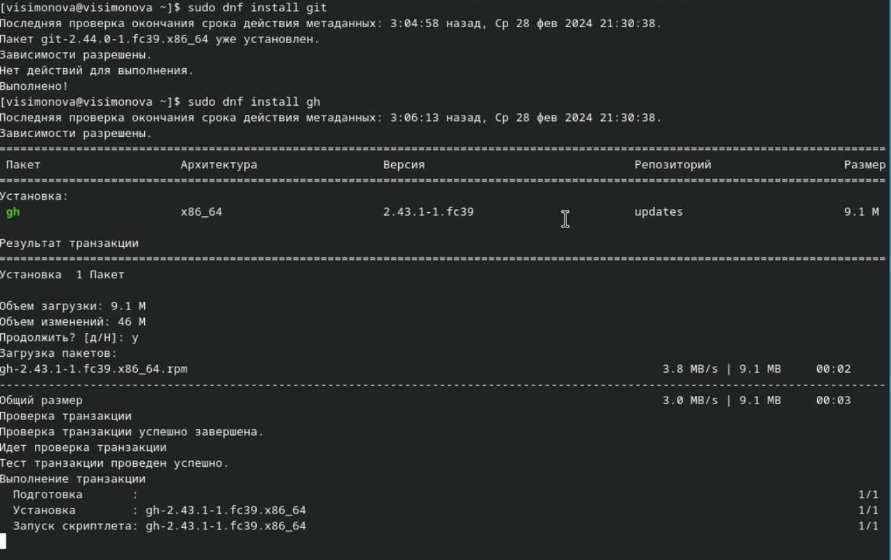

##

Задаю для имя и почту владельца репозитория.Настраиваю кодировку для корректного вывода сообщений в git. Задаю имя ветки. Параметр autoclaf, параметр safecrlf 

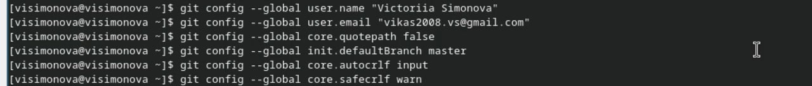

## Создание ключей SSH

Создание ключа SSH размер 4096 бит по алгоритму rsa 

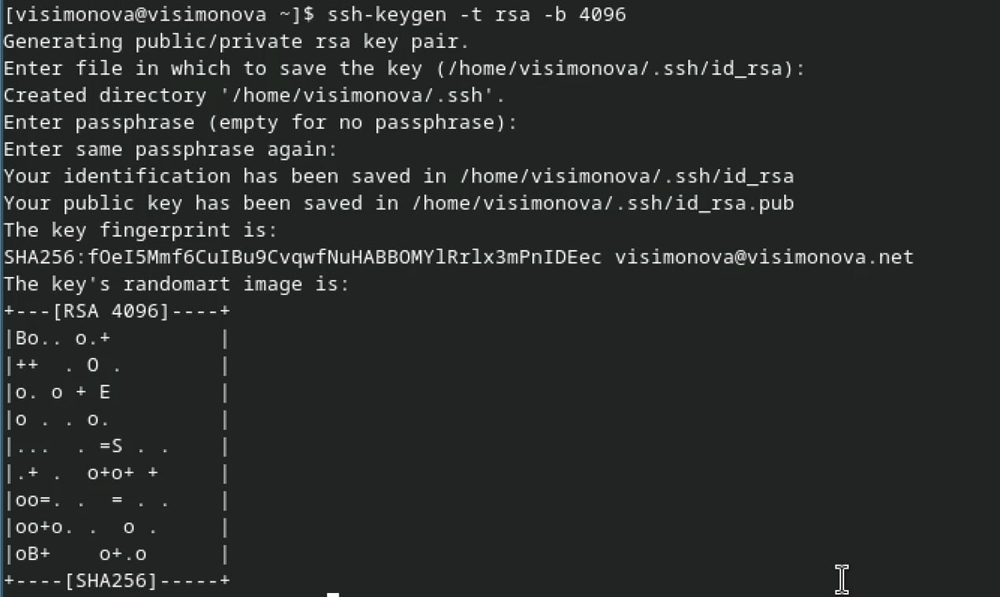

##

Создание ключа SSH по алгоритму ed25529 

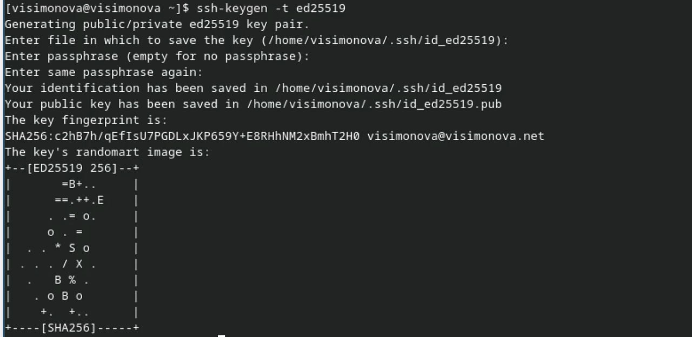

## Создание ключа PGP

Генерирую ключ PGP выбираю тип RSA and RSA, задаю максимальную длину ключа 4096, ставлю неогранниченный срок действия. Отвечаю на вопросы о личной информации и ввожу пароль для защиты новго ключа. 

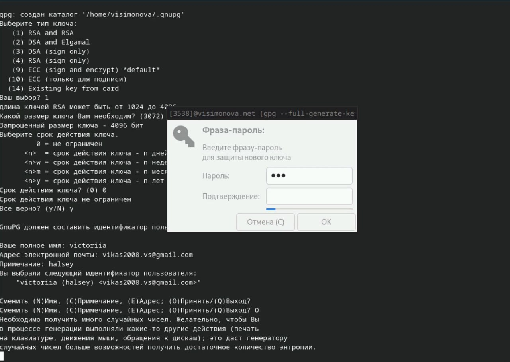

## Добавление ключа PGP в Github

Добавляю список созданных ключей , ищу отпечаток ключа , копирую 

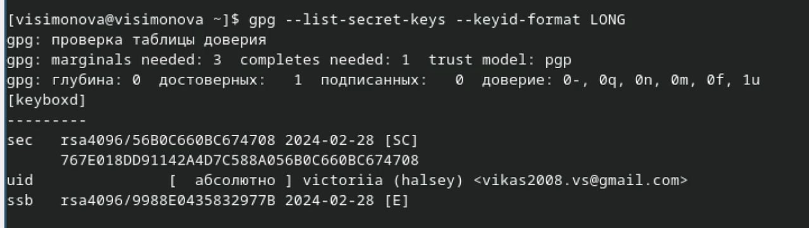

##

Копирую ключ 

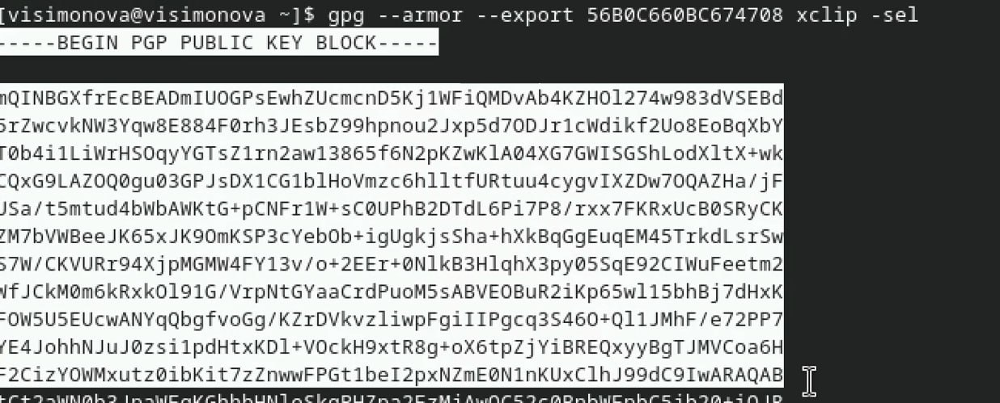

##

У меня уже есть аккаунт на Github 

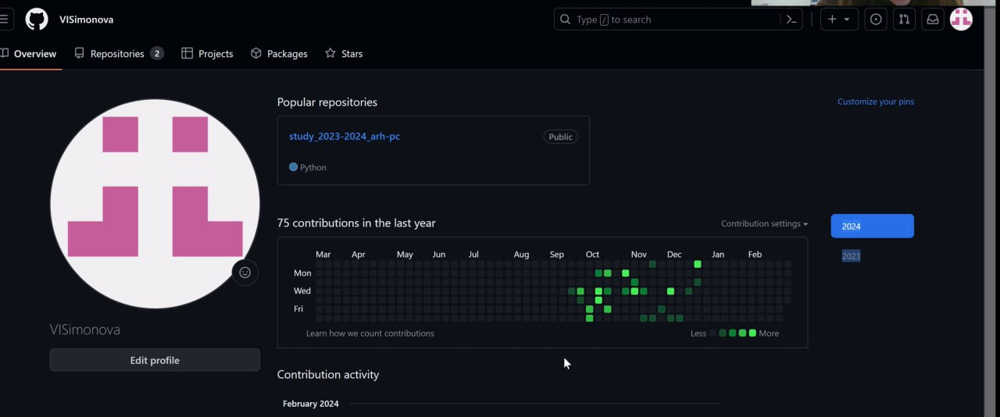

##

Вставляю ключ в поле на Github 

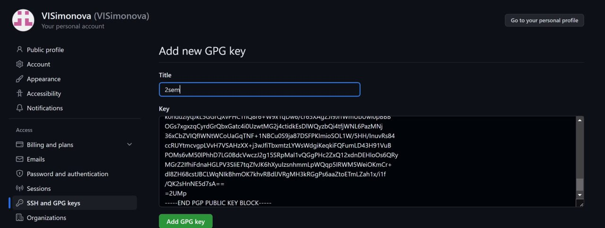

##

Я добавила ключ на Github 

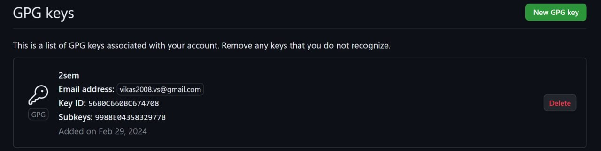

## Настройка автоматических подписей

Настройка автоматических подписей комитов с помощью введённого эмэйла 

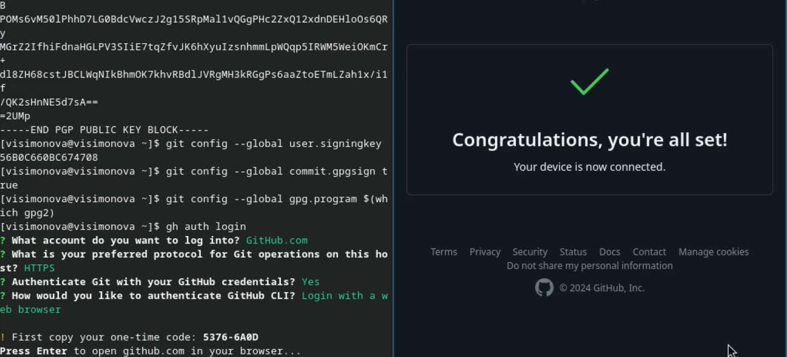

##

Сообщение о завершении авторизации 

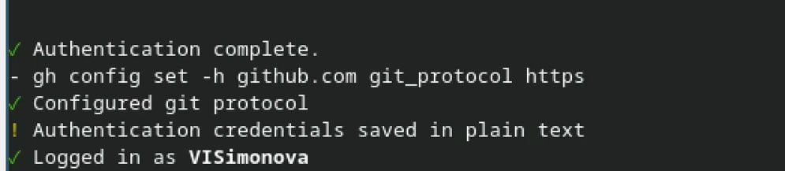

## Создание репозитория курса на основе шаблона

Создаю свою директорию с помощью mkdir и перехожу в нее. Далее в терминале ввожу команду, чтобы создать репозиторий на основе заданного шаблона 

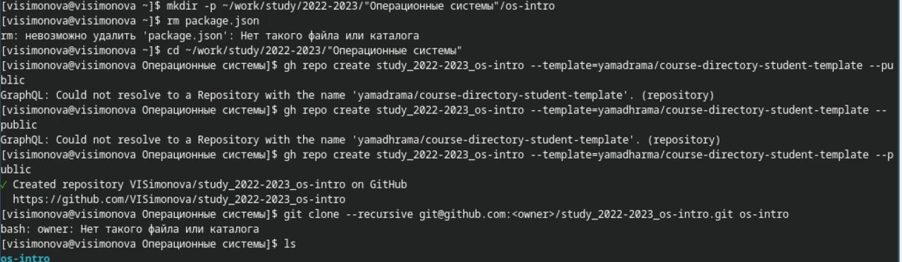

##

Клонирую рипозиторий к себе в директорию и переход туда 

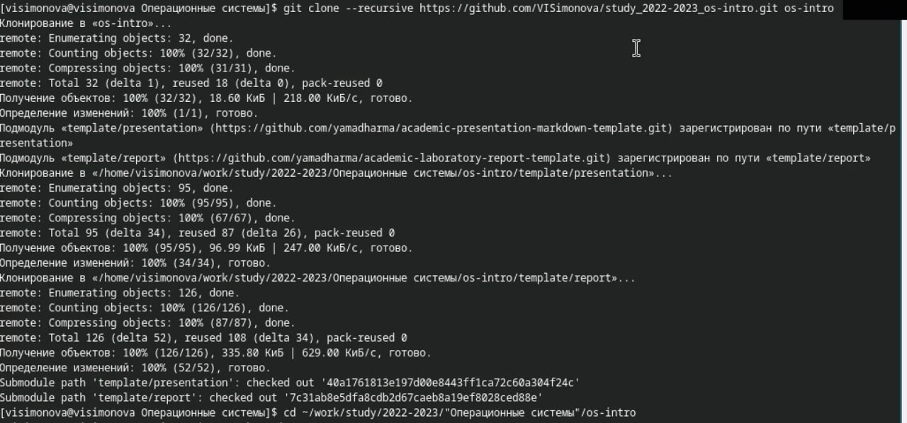

##

Удаляю лишние файлы и создаю необходимые каталоги 

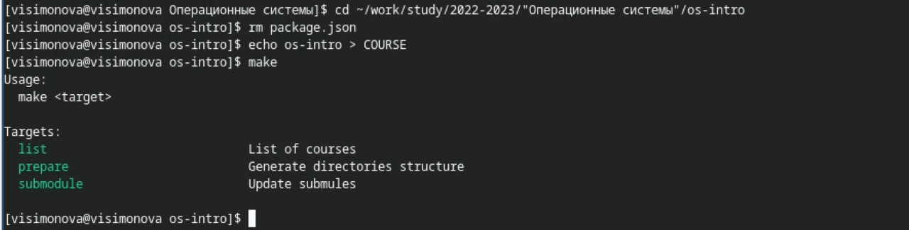

##

Выполняю git add для отправки файлов на сервер , git commit для их коментирования ,далее ввожу пароль для разблокировки ключа 

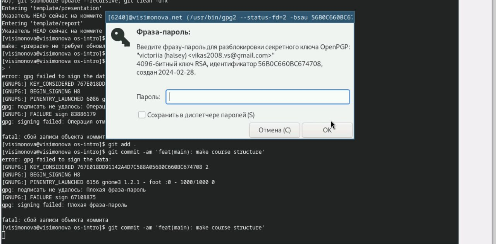

##

Отправляю файлы на сервер с помощью git push 

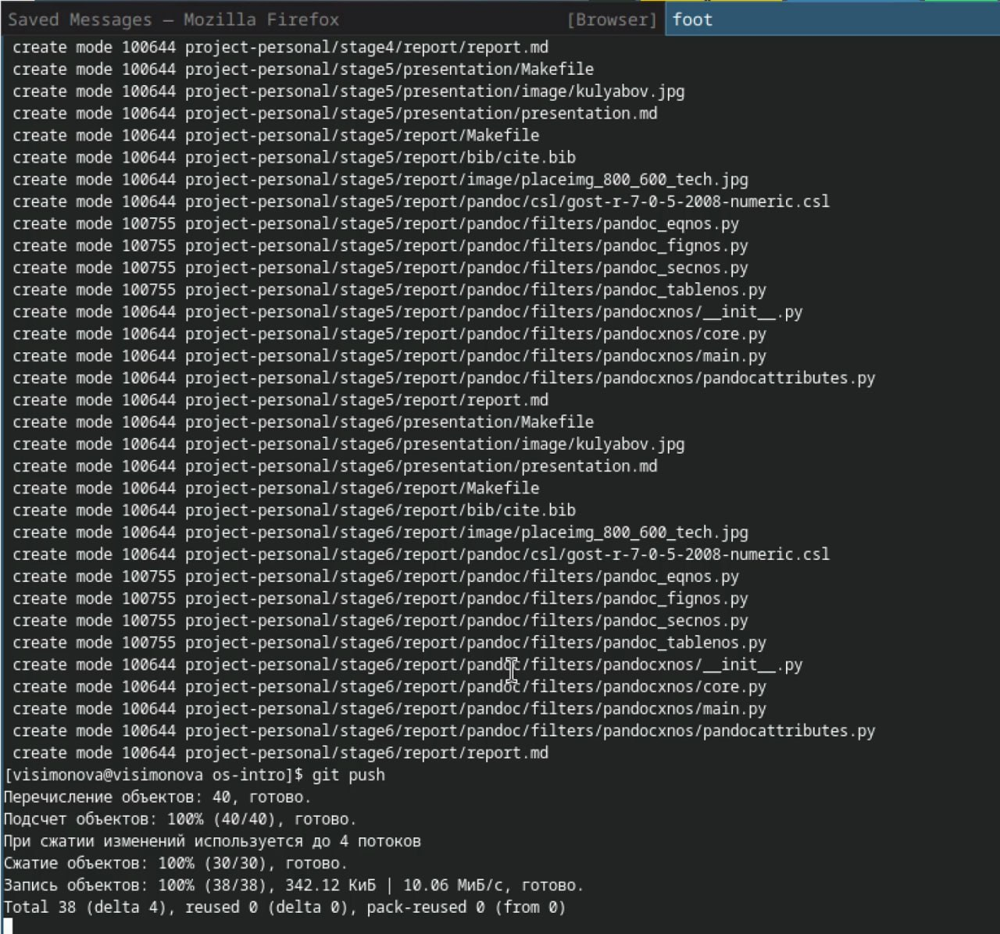

## Настройка автоматических подписей

Настройка автоматических подписей комитов с помощью введённого эмэйла 

##

Сообщение о завершении авторизации 

# Выводы

При выполнении лабораторной работы я изучила систему контроля версий git и применение средст контроля версий.

## Список литературы

# Список литературы{.unnumbered}

1. Dash, P. Getting Started with Oracle VM VirtualBox / P. Dash. – Packt Publishing Ltd, 2013. – 86 сс.
2. Colvin, H. VirtualBox: An Ultimate Guide Book on Virtualization with VirtualBox. VirtualBox / H. Colvin. – CreateSpace Independent Publishing Platform, 2015. – 70 сс.
3. Vugt, S. van. Red Hat RHCSA/RHCE 7 cert guide : Red Hat Enterprise Linux 7 (EX200 and EX300) : Certification Guide. Red Hat RHCSA/RHCE 7 cert guide / S. van Vugt. – Pearson IT Certification, 2016. – 1008 сс.
4. Робачевский, А. Операционная система UNIX / А. Робачевский, С. Немнюгин, О. Стесик. – 2-е изд. – Санкт-Петербург : БХВ-Петербург, 2010. – 656 сс.
5. Немет, Э. Unix и Linux: руководство системного администратора. Unix и Linux / Э. Немет, Г. Снайдер, Т.Р. Хейн, Б. Уэйли. – 4-е изд. – Вильямс, 2014. – 1312 сс.
6. Колисниченко, Д.Н. Самоучитель системного администратора Linux : Системный администратор / Д.Н. Колисниченко. – Санкт-Петербург : БХВ-Петербург, 2011. – 544 сс.
7. Robbins, A. Bash Pocket Reference / A. Robbins. – O’Reilly Media, 2016. – 156 сс.