---
## Front matter
title: "Лабораторная работа №2"
subtitle: ""
author: "Симонова Виктория Игоревна"

## Generic otions
lang: ru-RU
toc-title: "Содержание"

## Bibliography
bibliography: bib/cite.bib
csl: pandoc/csl/gost-r-7-0-5-2008-numeric.csl

## Pdf output format
toc: true # Table of contents
toc-depth: 2
lof: true # List of figures
lot: true # List of tables
fontsize: 12pt
linestretch: 1.5
papersize: a4
documentclass: scrreprt
## I18n polyglossia
polyglossia-lang:
  name: russian
  options:
	- spelling=modern
	- babelshorthands=true
polyglossia-otherlangs:
  name: english
## I18n babel
babel-lang: russian
babel-otherlangs: english
## Fonts
mainfont: PT Serif
romanfont: PT Serif
sansfont: PT Sans
monofont: PT Mono
mainfontoptions: Ligatures=TeX
romanfontoptions: Ligatures=TeX
sansfontoptions: Ligatures=TeX,Scale=MatchLowercase
monofontoptions: Scale=MatchLowercase,Scale=0.9
## Biblatex
biblatex: true
biblio-style: "gost-numeric"
biblatexoptions:
  - parentracker=true
  - backend=biber
  - hyperref=auto
  - language=auto
  - autolang=other*
  - citestyle=gost-numeric
## Pandoc-crossref LaTeX customization
figureTitle: "Рис."
tableTitle: "Таблица"
listingTitle: "Листинг"
lofTitle: "Список иллюстраций"
lotTitle: "Список таблиц"
lolTitle: "Листинги"
## Misc options
indent: true
header-includes:
  - \usepackage{indentfirst}
  - \usepackage{float} # keep figures where there are in the text
  - \floatplacement{figure}{H} # keep figures where there are in the text
---

# Цель работы

Цель данной лабораторной работы - изучение применения средств контроля версий git.

# Задание

1. Создать базовую конфигурацию для работы с git
2. Создать ключь SHH
3. Создать ключь GPG
4. Настроить подписи к коммитам
5. Зарегестрироваться на gihub
6. Создать локальный каталог для выполнения заданий по предмету

# Теоретическое введение

Системы контроля версий. Общие понятия
Системы контроля версий (Version Control System, VCS) применяются при работе нескольких человек над одним проектом. Обычно основное дерево проекта хранится в локальном или удалённом репозитории, к которому настроен доступ для участников проекта. При внесении изменений в содержание проекта система контроля версий позволяет их фиксировать, совмещать изменения, произведённые разными участниками проекта, производить откат к любой более ранней версии проекта, если это требуется.
В классических системах контроля версий используется централизованная модель, предполагающая наличие единого репозитория для хранения файлов. Выполнение большинства функций по управлению версиями осуществляется специальным сервером. Участник проекта (пользователь) перед началом работы посредством определённых команд получает нужную ему версию файлов. После внесения изменений, пользователь размещает новую версию в хранилище. При этом предыдущие версии не удаляются из центрального хранилища и к ним можно вернуться в любой момент. Сервер может сохранять не полную версию изменённых файлов, а производить так называемую дельта-компрессию — сохранять только изменения между последовательными версиями, что позволяет уменьшить объём хранимых данных.
Системы контроля версий поддерживают возможность отслеживания и разрешения конфликтов, которые могут возникнуть при работе нескольких человек над одним файлом. Можно объединить (слить) изменения, сделанные разными участниками (автоматически или вручную), вручную выбрать нужную версию, отменить изменения вовсе или заблокировать файлы для изменения. В зависимости от настроек блокировка не позволяет другим пользователям получить рабочую копию или препятствует изменению рабочей копии файла средствами файловой системы ОС, обеспечивая таким образом, привилегированный доступ только одному пользователю, работающему с файлом.
Системы контроля версий также могут обеспечивать дополнительные, более гибкие функциональные возможности. Например, они могут поддерживать работу с несколькими версиями одного файла, сохраняя общую историю изменений до точки ветвления версий и собственные истории изменений каждой ветви. Кроме того, обычно доступна информация о том, кто из участников, когда и какие изменения вносил. Обычно такого рода информация хранится в журнале изменений, доступ к которому можно ограничить.
В отличие от классических, в распределённых системах контроля версий центральный репозиторий не является обязательным.
Среди классических VCS наиболее известны CVS, Subversion, а среди распределённых — Git, Bazaar, Mercurial. Принципы их работы схожи, отличаются они в основном синтаксисом используемых в работе команд.

# Выполнение лабораторной работы

## Установка ПО

Устанавливаю необходимое ПО git и gh (рис. [-@fig:001]).

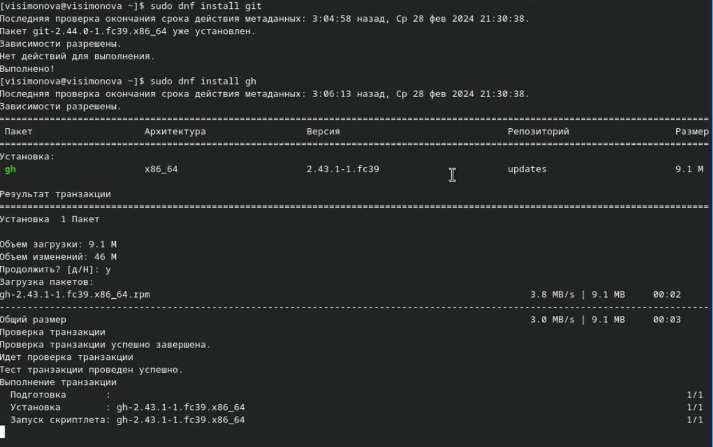{ #fig:001 width=70% }

Задаю для имя и почту владельца репозитория.Настраиваю кодировку для корректного вывода сообщений в git. Задаю имя ветки. Параметр autoclaf, параметр safecrlf (рис. [-@fig:002]).

{ #fig:002 width=70% }

## Создание ключей SSH

Создание ключа SSH размер 4096 бит по алгоритму rsa (рис. [-@fig:003]).

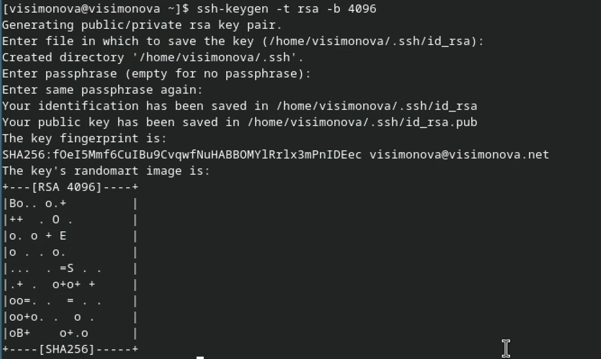{ #fig:003 width=70% }

Создание ключа SSH по алгоритму ed25529 (рис. [-@fig:004]).

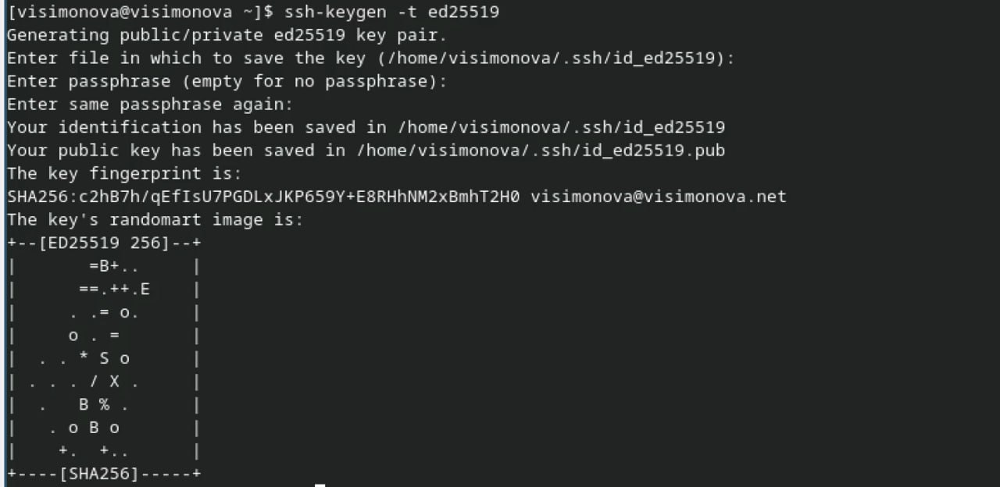{ #fig:004 width=70% }

## Создание ключа PGP

Генерирую ключ PGP выбираю тип RSA and RSA, задаю максимальную длину ключа 4096, ставлю неогранниченный срок действия. Отвечаю на вопросы о личной информации и ввожу пароль для защиты новго ключа. (рис. [-@fig:005]).

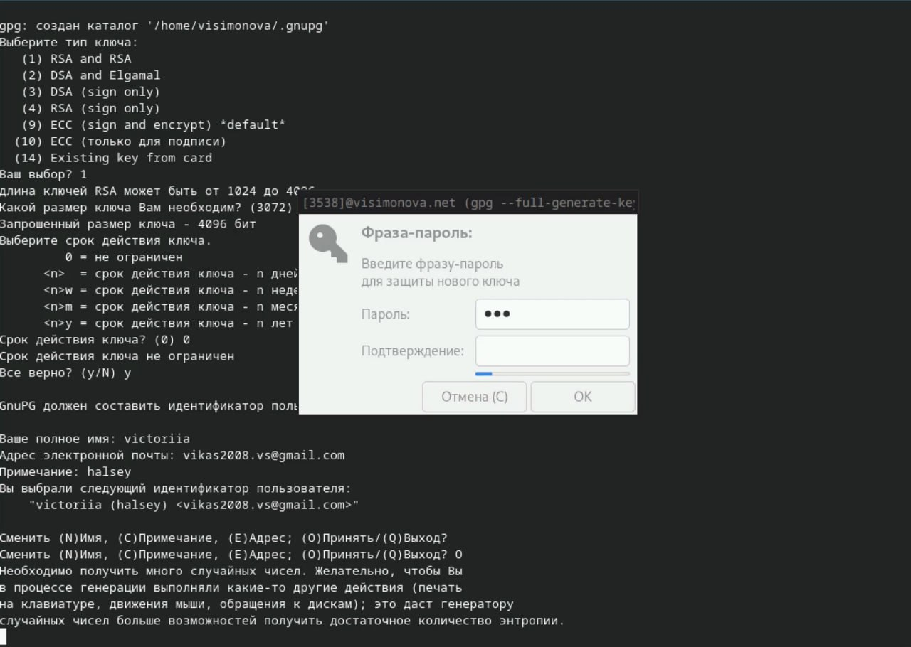{ #fig:005 width=70% }

## Добавление ключа PGP в Github

Добавляю список созданных ключей , ищу отпечаток ключа , копирую (рис. [-@fig:006]).

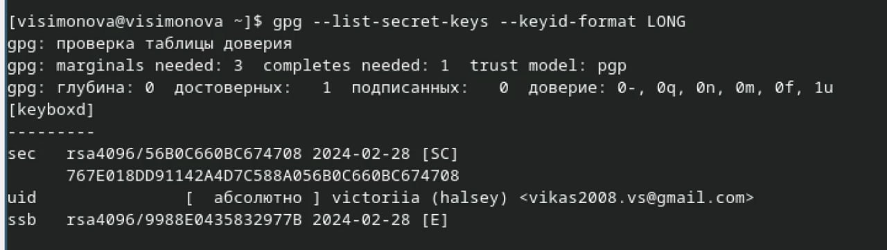{ #fig:006 width=70% }

Копирую ключ (рис. [-@fig:007]).

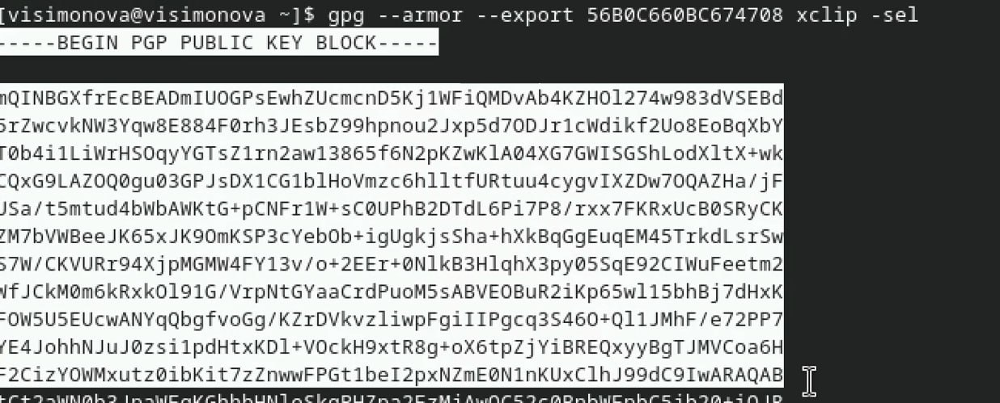{ #fig:007 width=70% }

У меня уже есть аккаунт на Github (рис. [-@fig:008]).

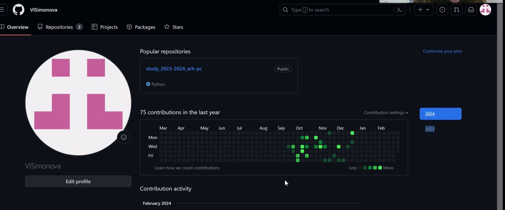{ #fig:008 width=70% }

Вставляю ключ в поле на Github (рис. [-@fig:009]).

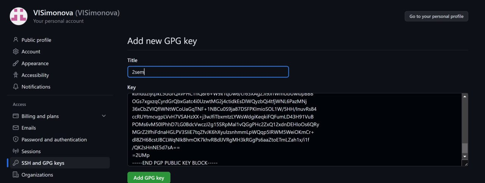{ #fig:009 width=70% }

Я добавила ключ на Github (рис. [-@fig:010]).

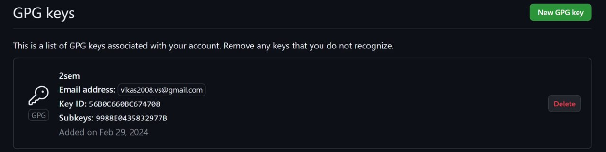{ #fig:010 width=70% }

## Настройка автоматических подписей

Настройка автоматических подписей комитов с помощью введённого эмэйла (рис. [-@fig:011]).

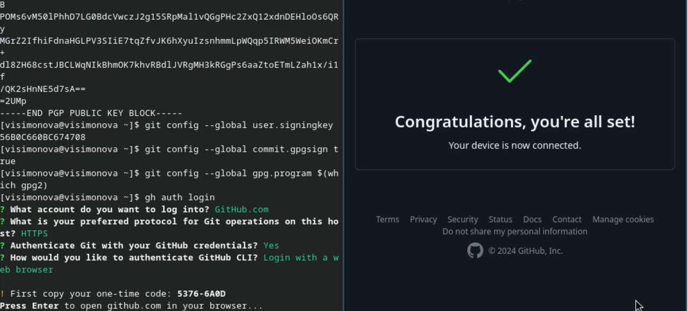{ #fig:011 width=70% }

Сообщение о завершении авторизации (рис. [-@fig:012]).

{ #fig:012 width=70% }

## Создание репозитория курса на основе шаблона

Создаю свою директорию с помощью mkdir и перехожу в нее. Далее в терминале ввожу команду, чтобы создать репозиторий на основе заданного шаблона (рис. [-@fig:013]).

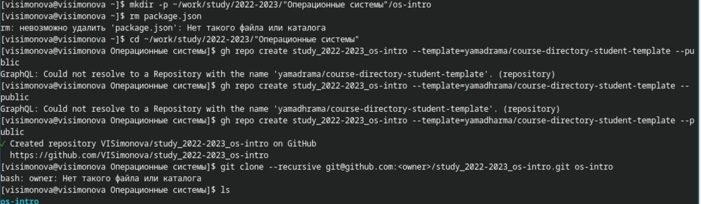{ #fig:013 width=70% }

Клонирую рипозиторий к себе в директорию и переход туда (рис. [-@fig:014]).

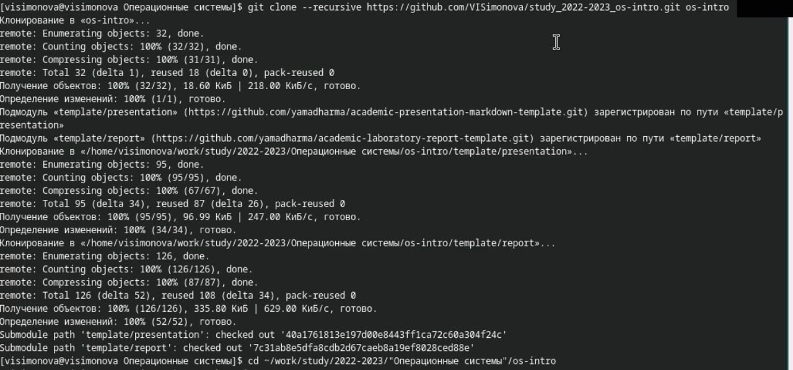{ #fig:014 width=70% }

Удаляю лишние файлы и создаю необходимые каталоги (рис. [-@fig:015]).

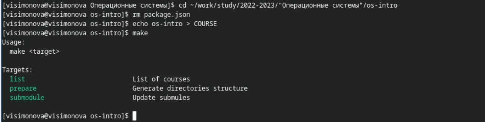{ #fig:015 width=70% }

Выполняю git add для отправки файлов на сервер , git commit для их коментирования ,далее ввожу пароль для разблокировки ключа (рис. [-@fig:016]).

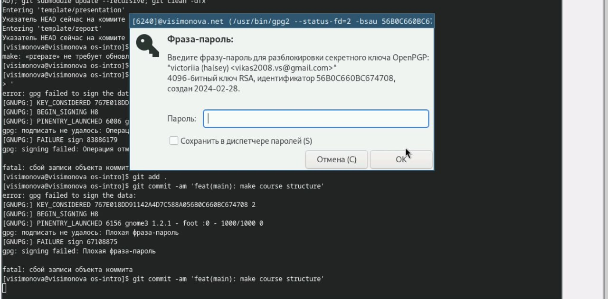{ #fig:016 width=70% }

Отправляю файлы на сервер с помощью git push (рис. [-@fig:017]).

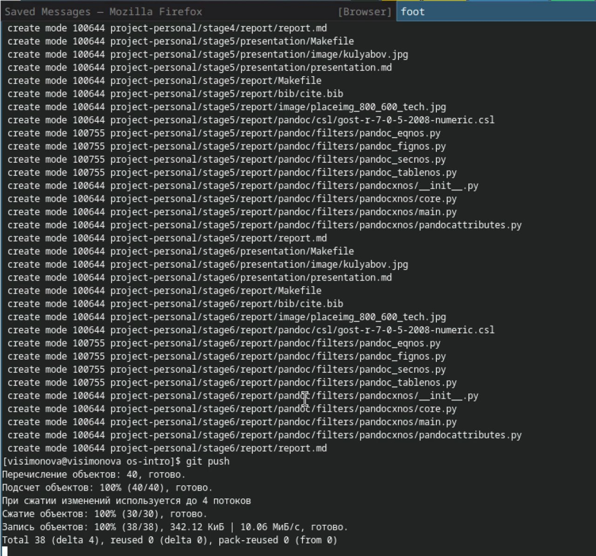{ #fig:017 width=70% }

# Выводы

При выполнении лабораторной работы я изучила систему контроля версий git и применение средст контроля версий.

# Ответы на контрольные вопросы

1. Системы контроля версий - ПО для работы с изменяющейся информацией и сохранения её версий. Может использоваться для работы нескольких человек над проектом, позволяет посмотреть кто какие изменения закомитил(полная история).

2. Хранилище -репозиторий, где хранятся верссии и история всех изменений проекта. commit - позволяет отслеживать историю изменений, тк позволяет обратиться к нужным данным. Рабочая копия - это основная копия проека.

3.Централизованные VCS (например: CVS, TFS, AccuRev) -- одно основное хранилище всего проекта. Каждый пользователь копирует себе необходимые ему файлы из этого репозитория, изменяет, затем добавляет изменения обратно в хранилище. Децентрализованные VCS (например: Git, Bazaar) -- у каждого пользователя свой вариант репозитория (возможно несколько вариантов), есть возможность добавлять и забирать изменения из любого репозитория. В отличие от классических, в распределенных (децентралиованных) системах контроля версий центральный репозиторий не является обязательным.

4. Сначала создается и подключается удаленный репозиторий, затем по мере изменения проекта эти изменения отправляются на сервер.

5. Участник проекта перед началом работы получает нужную ему версию проекта в хранилище, с помощью определенных команд, после внесения изменений пользователь размещает новую версию в хранилище. При этом предыдущие версии не удаляются. К ним можно вернуться в любой момент.

6. Хранение информации о всех изменениях в вашем коде, обеспечение удобства командной работы над кодом.

7. Создание основного дерева репозитория: git init

Получение обновлений (изменений) текущего дерева из центрального репозитория: git pull

Отправка всех произведённых изменений локального дерева в центральный репозиторий: git push

Просмотр списка изменённых файлов в текущей директории: git status

Просмотр текущих изменений: git diff

Сохранение текущих изменений: добавить все изменённые и/или созданные файлы и/или каталоги: git add .

добавить конкретные изменённые и/или созданные файлы и/или каталоги: git add имена_файлов

удалить файл и/или каталог из индекса репозитория (при этом файл и/или каталог остаётся в локальной директории): git rm имена_файлов

Сохранение добавленных изменений:

сохранить все добавленные изменения и все изменённые файлы: git commit -am 'Описание коммита'

сохранить добавленные изменения с внесением комментария через встроенный редактор: git commit

создание новой ветки, базирующейся на текущей: git checkout -b имя_ветки

переключение на некоторую ветку: git checkout имя_ветки (при переключении на ветку, которой ещё нет в локальном репозитории, она будет создана и связана с удалённой)

отправка изменений конкретной ветки в центральный репозиторий: git push origin имя_ветки

слияние ветки с текущим деревом: git merge --no-ff имя_ветки

Удаление ветки:

удаление локальной уже слитой с основным деревом ветки: git branch -d имя_ветки

принудительное удаление локальной ветки: git branch -D имя_ветки

удаление ветки с центрального репозитория: git push origin :имя_ветки

8. git push -all отправляем из локального репозитория все сохраненные изменения в центральный репозиторий, предварительно создав локальный репозиторий и сделав предварительную конфигурацию.

9. Ветвление - один из параллельных участков в одном хранилище, исходящих из одной версии, обычно есть главная ветка. 
Между ветками, т. е. их концами возможно их слияние. Используются для разработки новых функций.

10. Во время работы над проектом могут создаваться файлы, которые не следуют добавлять в репозиторий. Например, временные файлы.
Можно прописать шаблоны игнорируемых при добавлении в репозиторий типов файлов в файл .gitignore с помощью сервисов.

# Список литературы{.unnumbered}

::: {#refs}
1. Лабораторная работа № 2 [Электронный ресурс] URL: https://esystem.rudn.ru/mod/page/view.php?id=970819
:::
