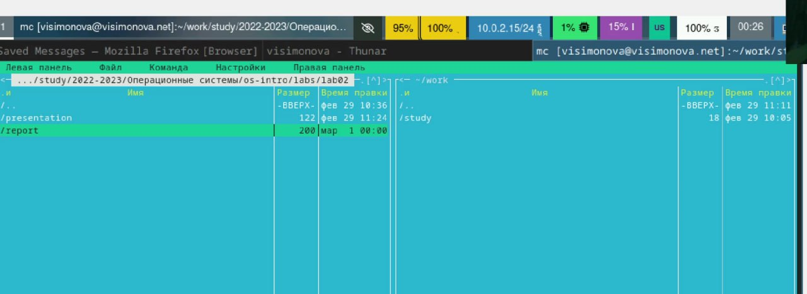
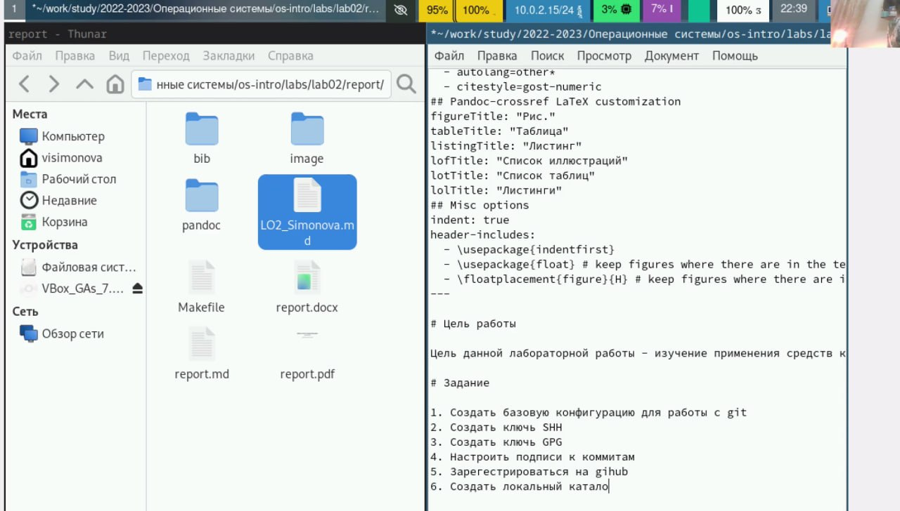
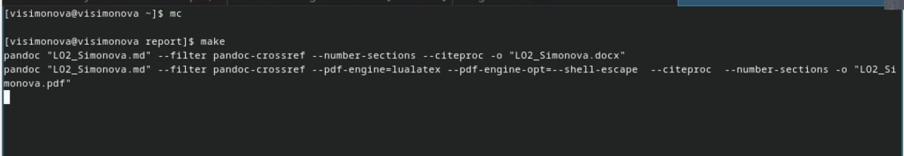
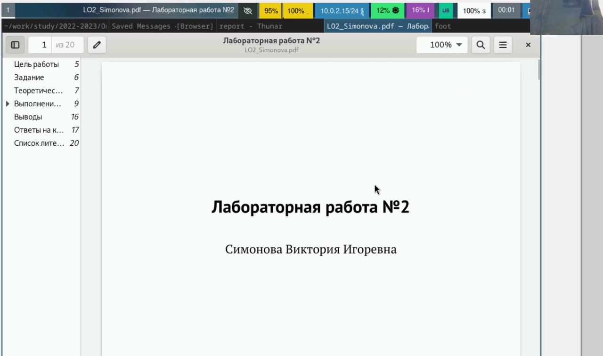
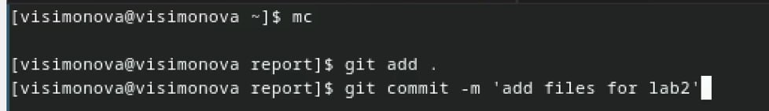

---
## Front matter
lang: ru-RU
title: Лабораторная работа № 3
subtitle: 
author:
  - Симонова В.И.
institute:
  - Российский университет дружбы народов, Москва, Россия
  - НКАбд-05-23
date: 2 марта 2024

## i18n babel
babel-lang: russian
babel-otherlangs: english

## Formatting pdf
toc: false
toc-title: Содержание
slide_level: 2
aspectratio: 169
section-titles: true
theme: metropolis
header-includes:
 - \metroset{progressbar=frametitle,sectionpage=progressbar,numbering=fraction}
 - '\makeatletter'
 - '\beamer@ignorenonframefalse'
 - '\makeatother'

## Fonts
mainfont: PT Serif
romanfont: PT Serif
sansfont: PT Sans
monofont: PT Mono
mainfontoptions: Ligatures=TeX
romanfontoptions: Ligatures=TeX
sansfontoptions: Ligatures=TeX,Scale=MatchLowercase
monofontoptions: Scale=MatchLowercase,Scale=0.9
---

## Докладчик

:::::::::::::: {.columns align=center}
::: {.column width="70%"}

  * Симонова Виктория Игоревна
  * Студент 
  * НКАбд-05-23
  * Российский университет дружбы народов
  * [1132236012@pfur.ru](mailto:1132236012@rudn.ru)

:::
::: {.column width="30%"}

:::
::::::::::::::

# Цель работы

Цель данной работы - научиться выполнять отчёты с помощью языка разметки markdown.

# Задание

1. Сделайте отчёт по предыдущей лабораторной работе в markdown.
2. В качестве отчета предоставляются отчёты 3 форматов: pdf, docx, md.

# Теоретическое введение

Markdown — облегчённый язык разметки, созданный с целью обозначения форматирования в простом тексте, с максимальным сохранением его читаемости человеком, и пригодный для машинного преобразования в языки для продвинутых публикаций.

# Выполнение лабораторной работы

Перехожу в каталог второй лабораторной работы через mc копирую и переименовываю файл 

##

Открываю созданный файл с помощью  текстого редактора mousepad (который предварительно скачала) 

##

После изменения шаблона с помощью языка разметки markdown выполняю компиляцию форматов pdf, docx, md. с помощью команды make 

##

Проверка компиляции файла формата pdf 

##

Добавляю файлы в глобальный репозиторий 

##

Отправляю файлы в глобальный репозиторий с помощью команды git push 

# Выводы

В ходе выполнения лабораторной работы я научилась оформлять отчёты в формате markdown.

## Список литературы

# Список литературы{.unnumbered}

1. Dash, P. Getting Started with Oracle VM VirtualBox / P. Dash. – Packt Publishing Ltd, 2013. – 86 сс.
2. Colvin, H. VirtualBox: An Ultimate Guide Book on Virtualization with VirtualBox. VirtualBox / H. Colvin. – CreateSpace Independent Publishing Platform, 2015. – 70 сс.
3. Vugt, S. van. Red Hat RHCSA/RHCE 7 cert guide : Red Hat Enterprise Linux 7 (EX200 and EX300) : Certification Guide. Red Hat RHCSA/RHCE 7 cert guide / S. van Vugt. – Pearson IT Certification, 2016. – 1008 сс.
4. Робачевский, А. Операционная система UNIX / А. Робачевский, С. Немнюгин, О. Стесик. – 2-е изд. – Санкт-Петербург : БХВ-Петербург, 2010. – 656 сс.
5. Немет, Э. Unix и Linux: руководство системного администратора. Unix и Linux / Э. Немет, Г. Снайдер, Т.Р. Хейн, Б. Уэйли. – 4-е изд. – Вильямс, 2014. – 1312 сс.
6. Колисниченко, Д.Н. Самоучитель системного администратора Linux : Системный администратор / Д.Н. Колисниченко. – Санкт-Петербург : БХВ-Петербург, 2011. – 544 сс.
7. Robbins, A. Bash Pocket Reference / A. Robbins. – O’Reilly Media, 2016. – 156 сс.