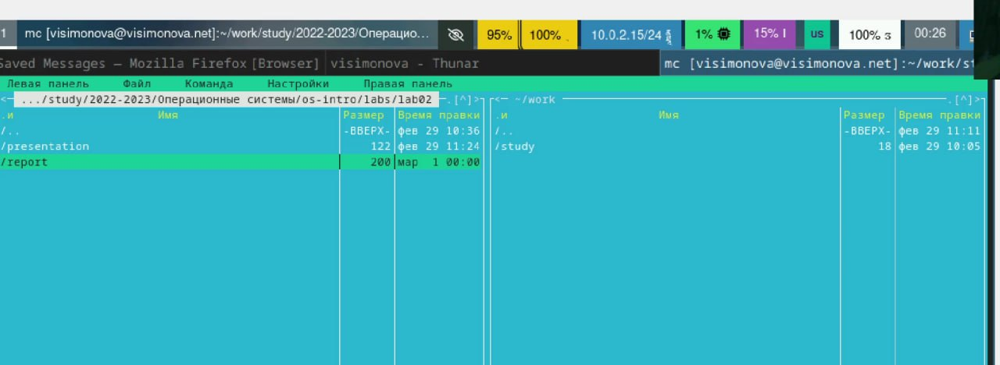
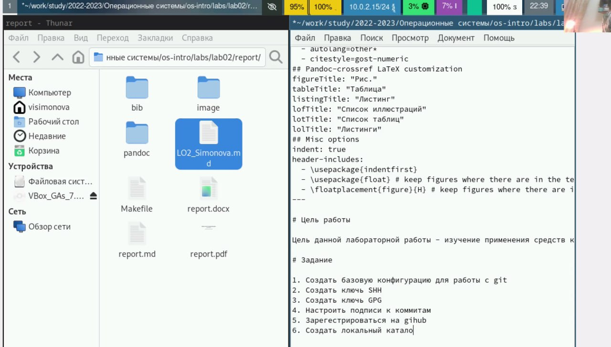
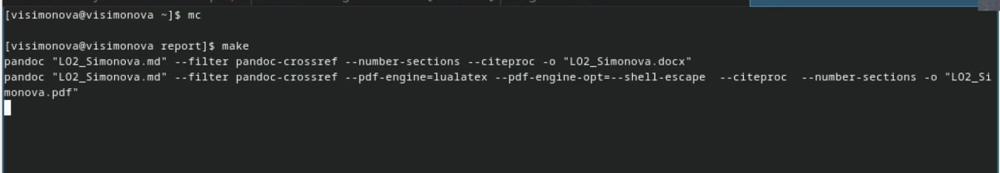
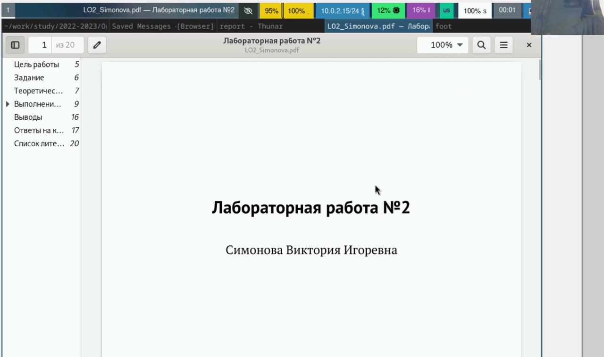
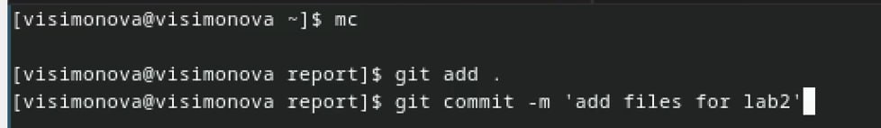
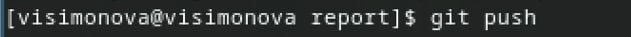

---
## Front matter
title: "Отчёт по лабораторной работе №3"
subtitle: ""
author: "Симонова Виктория Игоревна"

## Generic otions
lang: ru-RU
toc-title: "Содержание"

## Bibliography
bibliography: bib/cite.bib
csl: pandoc/csl/gost-r-7-0-5-2008-numeric.csl

## Pdf output format
toc: true # Table of contents
toc-depth: 2
lof: true # List of figures
lot: true # List of tables
fontsize: 12pt
linestretch: 1.5
papersize: a4
documentclass: scrreprt
## I18n polyglossia
polyglossia-lang:
  name: russian
  options:
	- spelling=modern
	- babelshorthands=true
polyglossia-otherlangs:
  name: english
## I18n babel
babel-lang: russian
babel-otherlangs: english
## Fonts
mainfont: PT Serif
romanfont: PT Serif
sansfont: PT Sans
monofont: PT Mono
mainfontoptions: Ligatures=TeX
romanfontoptions: Ligatures=TeX
sansfontoptions: Ligatures=TeX,Scale=MatchLowercase
monofontoptions: Scale=MatchLowercase,Scale=0.9
## Biblatex
biblatex: true
biblio-style: "gost-numeric"
biblatexoptions:
  - parentracker=true
  - backend=biber
  - hyperref=auto
  - language=auto
  - autolang=other*
  - citestyle=gost-numeric
## Pandoc-crossref LaTeX customization
figureTitle: "Рис."
tableTitle: "Таблица"
listingTitle: "Листинг"
lofTitle: "Список иллюстраций"
lotTitle: "Список таблиц"
lolTitle: "Листинги"
## Misc options
indent: true
header-includes:
  - \usepackage{indentfirst}
  - \usepackage{float} # keep figures where there are in the text
  - \floatplacement{figure}{H} # keep figures where there are in the text
---

# Цель работы

Цель данной работы - научиться выполнять отчёты с помощью языка разметки markdown.

# Задание

1. Сделайте отчёт по предыдущей лабораторной работе в markdown.
2. В качестве отчета предоставляются отчёты 3 форматов: pdf, docx, md.

# Теоретическое введение

Markdown — облегчённый язык разметки, созданный с целью обозначения форматирования в простом тексте, с максимальным сохранением его читаемости человеком, и пригодный для машинного преобразования в языки для продвинутых публикаций.

# Выполнение лабораторной работы

Перехожу в каталог второй лабораторной работы через mc копирую и переименовываю файл (рис. [-@fig:001]).

{ #fig:001 width=70% }

Открываю созданный файл с помощью  текстого редактора mousepad (который предварительно скачала) (рис. [-@fig:002]).

{ #fig:002 width=70% }

После изменения шаблона с помощью языка разметки markdown выполняю компиляцию форматов pdf, docx, md. с помощью команды make (рис. [-@fig:003]).

{ #fig:003 width=70% } 

Проверка компиляции файла формата pdf (рис. [-@fig:004]).

{ #fig:004 width=70% }

Добавляю файлы в глобальный репозиторий (рис. [-@fig:005]).

{ #fig:005 width=70% }

Отправляю файлы в глобальный репозиторий с помощью команды git push (рис. [-@fig:006]).

{ #fig:006 width=70% }

# Выводы

В ходе выполнения лабораторной работы я научилась оформлять отчёты в формате markdown.

