---
## Front matter
lang: ru-RU
title: Лабораторная работа № 4
subtitle: 
author:
  - Симонова В.И.
institute:
  - Российский университет дружбы народов, Москва, Россия
  - НКАбд-05-23
date: 9 марта 2024

## i18n babel
babel-lang: russian
babel-otherlangs: english

## Formatting pdf
toc: false
toc-title: Содержание
slide_level: 2
aspectratio: 169
section-titles: true
theme: metropolis
header-includes:
 - \metroset{progressbar=frametitle,sectionpage=progressbar,numbering=fraction}
 - '\makeatletter'
 - '\beamer@ignorenonframefalse'
 - '\makeatother'

## Fonts
mainfont: PT Serif
romanfont: PT Serif
sansfont: PT Sans
monofont: PT Mono
mainfontoptions: Ligatures=TeX
romanfontoptions: Ligatures=TeX
sansfontoptions: Ligatures=TeX,Scale=MatchLowercase
monofontoptions: Scale=MatchLowercase,Scale=0.9
---

## Докладчик

:::::::::::::: {.columns align=center}
::: {.column width="70%"}

  * Симонова Виктория Игоревна
  * Студент 
  * НКАбд-05-23
  * Российский университет дружбы народов
  * [1132236012@pfur.ru](mailto:1132236012@rudn.ru)

:::
::: {.column width="30%"}

:::
::::::::::::::

# Цель работы

Получение навыков правильной работы с репозиториями git. Конкретно в данной лабораторной работе мы работаем с  gitflow  это определённая надстройка над моделью git.

# Задание

* Выполнить работу для тестового репозитория.
* Преобразовать рабочий репозиторий в репозиторий с git-flow и conventional commits.

# Теоретическое введение

* Gitflow Workflow опубликована и популяризована Винсентом Дриссеном.
* Gitflow Workflow предполагает выстраивание строгой модели ветвления с учётом выпуска проекта.
* Данная модель отлично подходит для организации рабочего процесса на основе релизов.
* Работа по модели Gitflow включает создание отдельной ветки для исправлений ошибок в рабочей среде.
* Последовательность действий при работе по модели Gitflow:
+ Из ветки master создаётся ветка develop.
+ Из ветки develop создаётся ветка release.
+ Из ветки develop создаются ветки feature.
+ Когда работа над веткой feature завершена, она сливается с веткой develop.
+ Когда работа над веткой релиза release завершена, она сливается в ветки develop и master.
+ Если в master обнаружена проблема, из master создаётся ветка hotfix.
+ Когда работа над веткой исправления hotfix завершена, она сливается в ветки develop и master.

# Выполнение лабораторной работы

## Установка git-flow

Установка из коллекции репозиториев Copr 

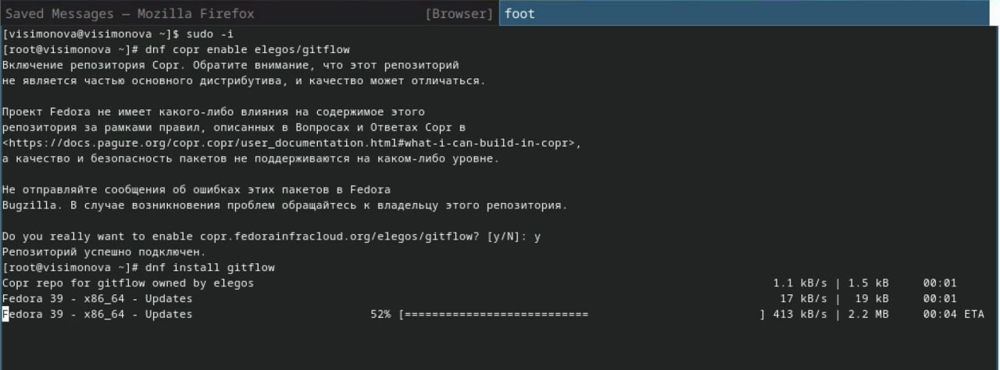

## Установка Node.js

На Node.js базируется программное обеспечение для семантического версионирования и общепринятых коммитов.

##

Выполняю команды 

## Настройка Node.js

Для работы с Node.js добавляю каталог с исполняемыми файлами, устанавливаемыми yarn, в переменную PATH.Запускаю установку 

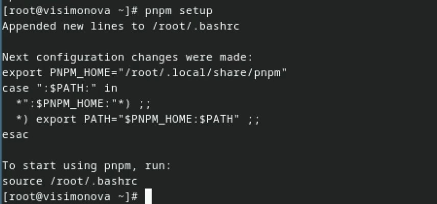

##

Выполняю команду source ~/.bashrc 

## Общепринятые коммиты

Устанавливаю commitizen.Данная программа используется для помощи в форматировании коммитов.(скрипт git cz) 

##

Устqанавливаю standard-changelog. Данная программа используется для помощи в создании логов. 

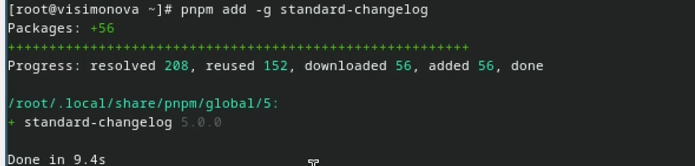

##

Создаю новый git репозиторий 

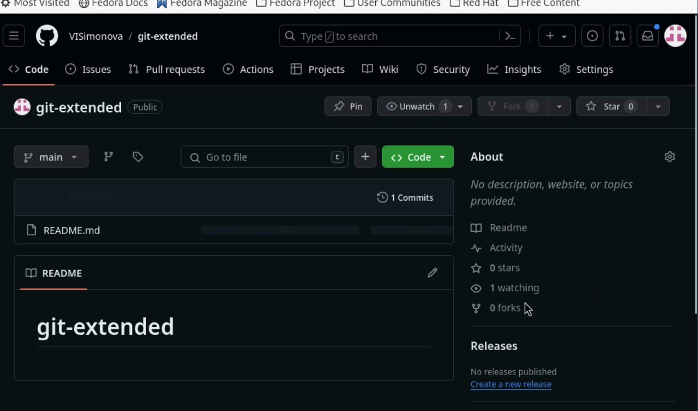

##

Клонирую репощиторий к себе на компьютер делаею первый коммит и выкладываю на github 

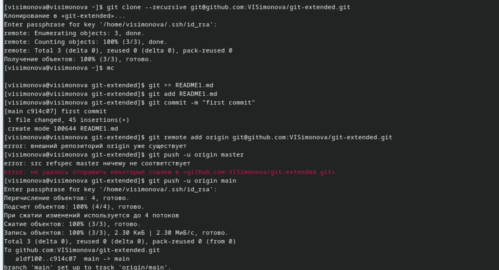

##

Конфигурация для пакетов Node.js 

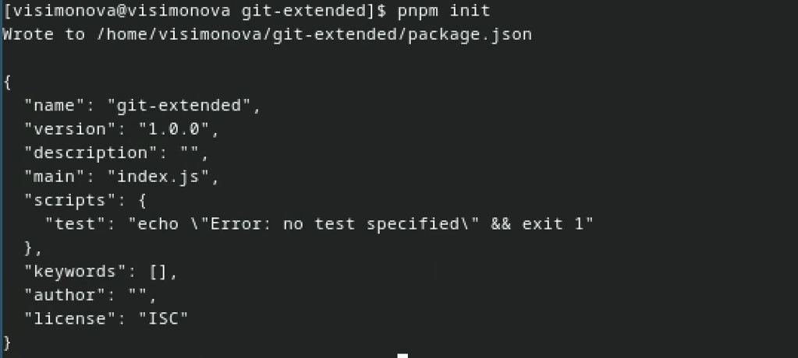

##

Изменяю файл package.json 

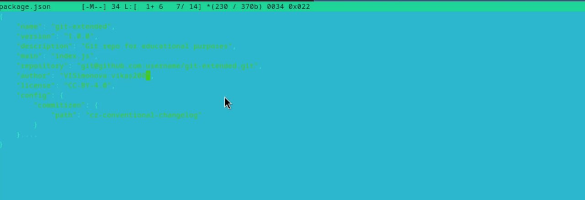

##

Добавляю новые файлы выполняю коммит и отправляю на github 

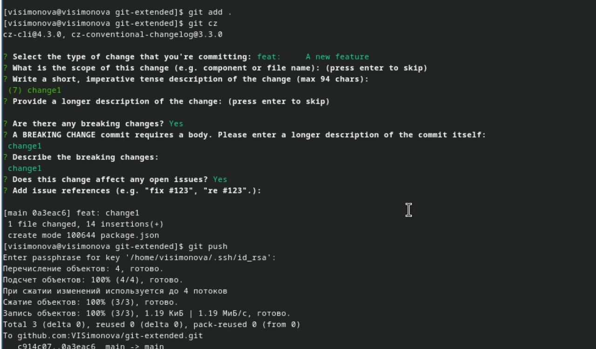

##

Инициализируем git-flow 

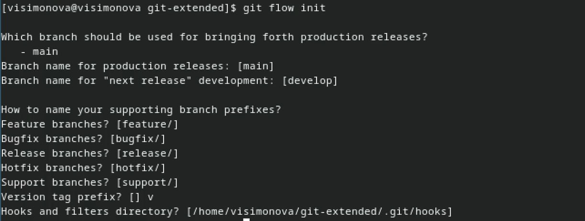

##

Проверяю ветку и загружаю репощиторий в хранилище 

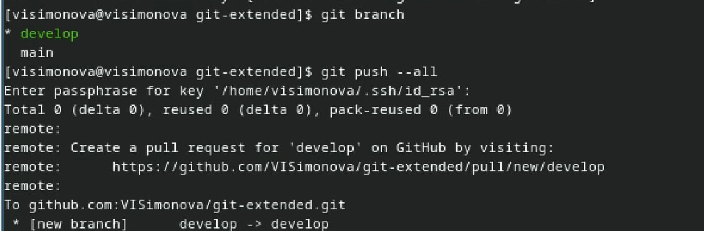

##

Установливаю внешнюю ветку как вышестоящую для этой ветки. Создадаю релиз с версией 1.0.0. Создадаю журнал изменений. Добавляю журнал изменений в индекс 

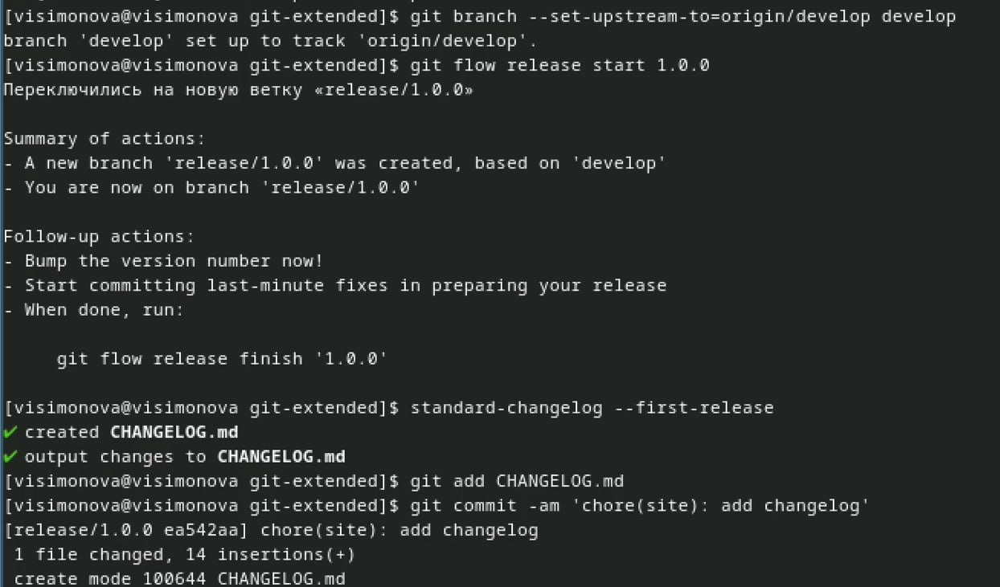

##

Заливаю релизную ветку в основную 

##

Обозначаю цель изменений 

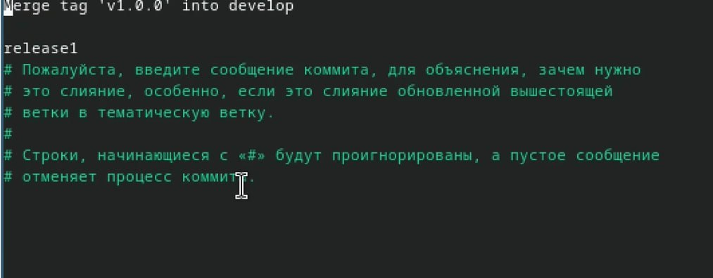

##

Вижу сообщение об успешном завершении процесса 

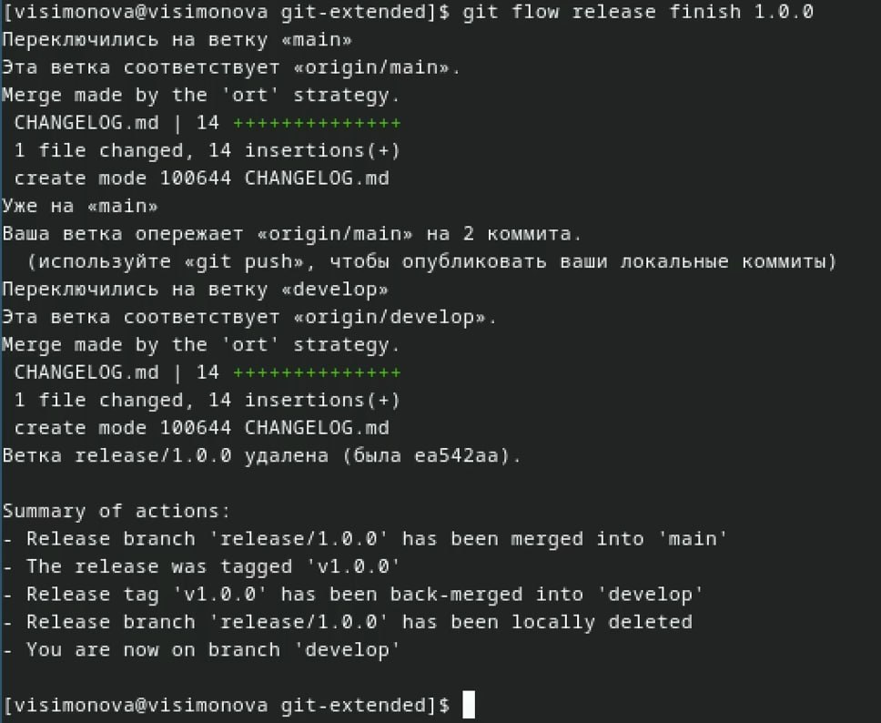

##

Отправляю данные на github и создаю релиз 

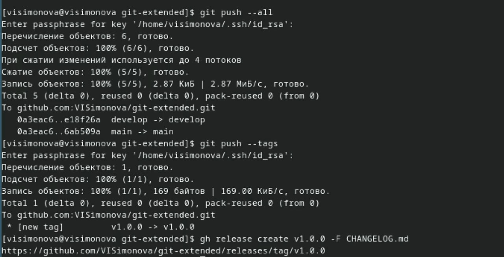

##

Проверяю созданный релиз вводя полученную ссылку в адресную строку 

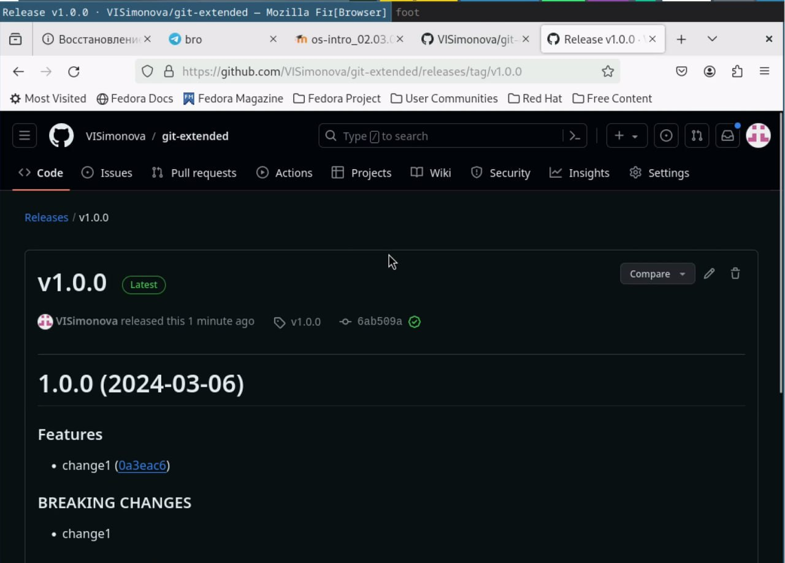

##

Создадю ветку для новой функциональности и сразу же объелиняю её с веткой разработки 

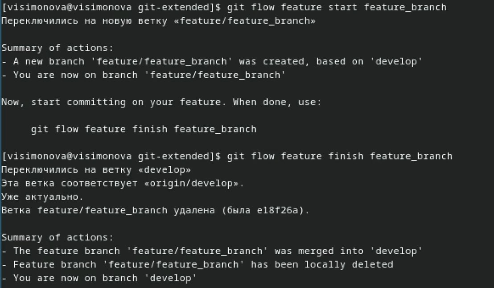

##

Создаю релиз с версией 1.2.3 

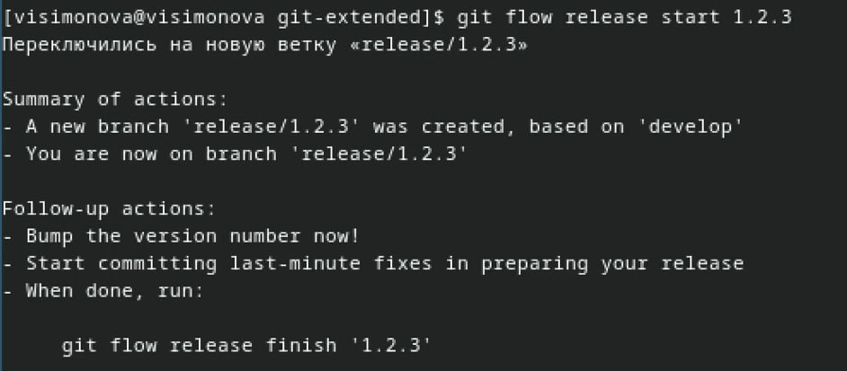

##

Изменяю номер версии в файле package.json. 

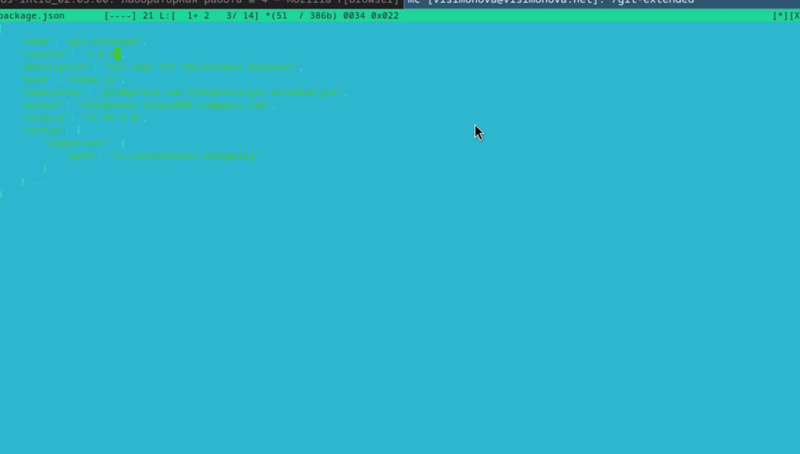

##

Создадаю журнал изменений. Добавляю журнал изменений в индекс.Отправляю данные 

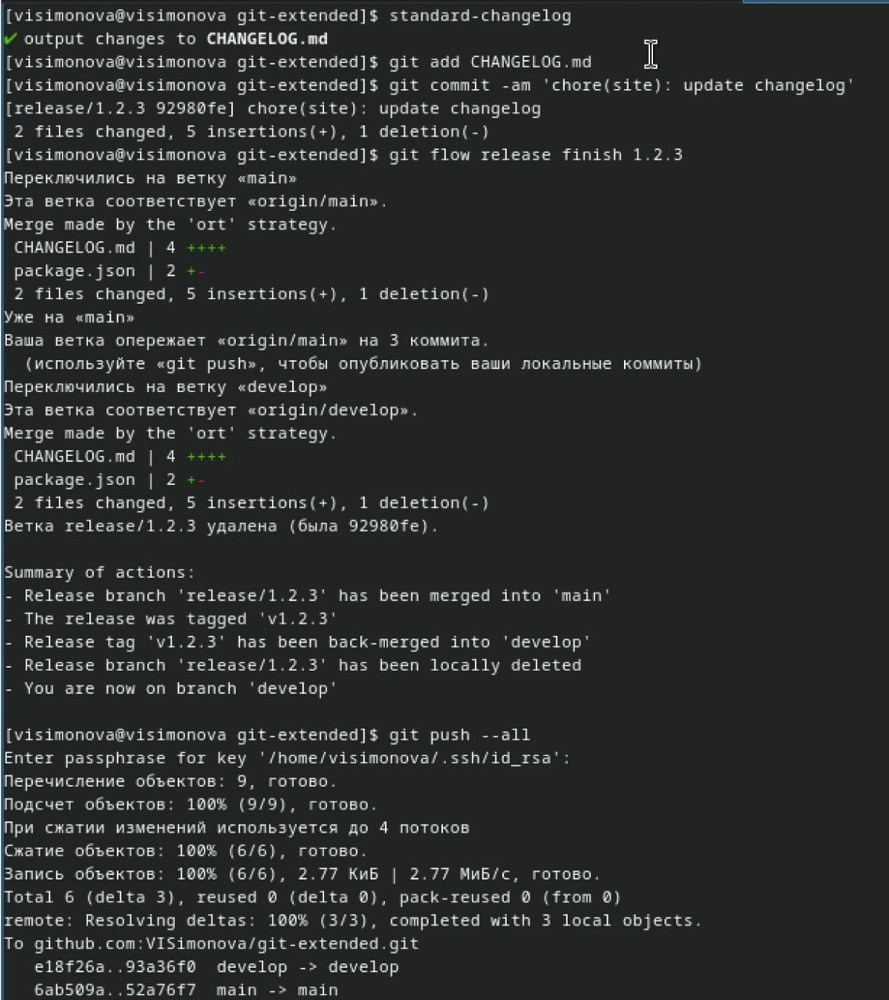

##

Отправляю данные на github. Создаю релиз на github с комментарием из журнала изменений  

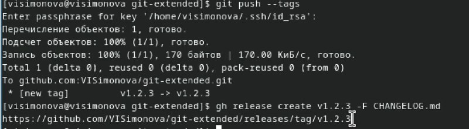

##

Проверяю созданный релиз вводя полученную ссылку в адресную строку 

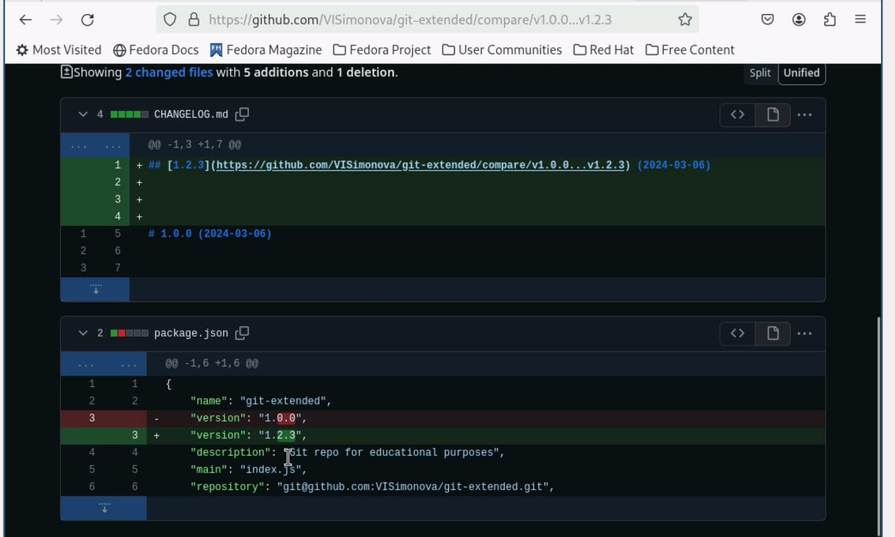

# Выводы

Получила практические навыки работы с репозиториями git 

# Список литературы{.unnumbered}

1. Dash, P. Getting Started with Oracle VM VirtualBox / P. Dash. – Packt Publishing Ltd, 2013. – 86 сс.
2. Colvin, H. VirtualBox: An Ultimate Guide Book on Virtualization with VirtualBox. VirtualBox / H. Colvin. – CreateSpace Independent Publishing Platform, 2015. – 70 сс.
3. Vugt, S. van. Red Hat RHCSA/RHCE 7 cert guide : Red Hat Enterprise Linux 7 (EX200 and EX300) : Certification Guide. Red Hat RHCSA/RHCE 7 cert guide / S. van Vugt. – Pearson IT Certification, 2016. – 1008 сс.
4. Робачевский, А. Операционная система UNIX / А. Робачевский, С. Немнюгин, О. Стесик. – 2-е изд. – Санкт-Петербург : БХВ-Петербург, 2010. – 656 сс.
5. Немет, Э. Unix и Linux: руководство системного администратора. Unix и Linux / Э. Немет, Г. Снайдер, Т.Р. Хейн, Б. Уэйли. – 4-е изд. – Вильямс, 2014. – 1312 сс.
6. Колисниченко, Д.Н. Самоучитель системного администратора Linux : Системный администратор / Д.Н. Колисниченко. – Санкт-Петербург : БХВ-Петербург, 2011. – 544 сс.
7. Robbins, A. Bash Pocket Reference / A. Robbins. – O’Reilly Media, 2016. – 156 сс.

