---
## Front matter
lang: ru-RU
title: Лабораторная работа № 5
subtitle: 
author:
  - Симонова В.И.
institute:
  - Российский университет дружбы народов, Москва, Россия
  - НКАбд-05-23
date: 12 марта 2024

## i18n babel
babel-lang: russian
babel-otherlangs: english

## Formatting pdf
toc: false
toc-title: Содержание
slide_level: 2
aspectratio: 169
section-titles: true
theme: metropolis
header-includes:
 - \metroset{progressbar=frametitle,sectionpage=progressbar,numbering=fraction}
 - '\makeatletter'
 - '\beamer@ignorenonframefalse'
 - '\makeatother'

## Fonts
mainfont: PT Serif
romanfont: PT Serif
sansfont: PT Sans
monofont: PT Mono
mainfontoptions: Ligatures=TeX
romanfontoptions: Ligatures=TeX
sansfontoptions: Ligatures=TeX,Scale=MatchLowercase
monofontoptions: Scale=MatchLowercase,Scale=0.9
---

## Докладчик

:::::::::::::: {.columns align=center}
::: {.column width="70%"}

  * Симонова Виктория Игоревна
  * Студент 
  * НКАбд-05-23
  * Российский университет дружбы народов
  * [1132236012@pfur.ru](mailto:1132236012@rudn.ru)

:::
::: {.column width="30%"}

:::
::::::::::::::

# Цель работы

Настройка рабочей среды. Создание репозитория и преобретение навыков для работы с менеджером паролей.

# Задание

1. Настроить менеджер паролей
2. Установить дополнительное ПО

# Теоретическое введение

1. Менеджер паролей pass

* Менеджер паролей pass — программа, сделанная в рамках идеологии Unix.
* Также носит название стандартного менеджера паролей для Unix (The standard Unix password manager).

2. Основные свойства

* Данные хранятся в файловой системе в виде каталогов и файлов.
* Файлы шифруются с помощью GPG-ключа.

3. Структура базы паролей

* Структура базы может быть произвольной, если Вы собираетесь использовать её напрямую, без промежуточного программного обеспечения. Тогда семантику структуры базы данных Вы держите в своей голове.
* Если же необходимо использовать дополнительное программное обеспечение, необходимо семантику заложить в структуру базы паролей.

##

4. Семантическая структура базы паролей

* Рассмотрим пользователя user в домене example.com, порт 22.
* Отсутствие имени пользователя или порта в имени файла означает, что любое имя пользователя и порт будут совпадать:
* example.com.pgp
* Соответствующее имя пользователя может быть именем файла внутри каталога, имя которого совпадает с хостом. Это полезно, если в базе есть пароли для нескольких пользователей на одном хосте:
* example.com/user.pgp
* Имя пользователя также может быть записано в виде префикса, отделенного от хоста знаком @:
* user@example.com.pgp
* Соответствующий порт может быть указан после хоста, отделённый двоеточием (:):
* example.com:22.pgp
* example.com:22/user.pgp
* user@example.com:22.pgp
* Эти все записи могут быть расположены в произвольных каталогах, задающих Вашу собственную иерархию.

# Выполнение лабораторной работы

Устанавливаю менеджер паролей pass 

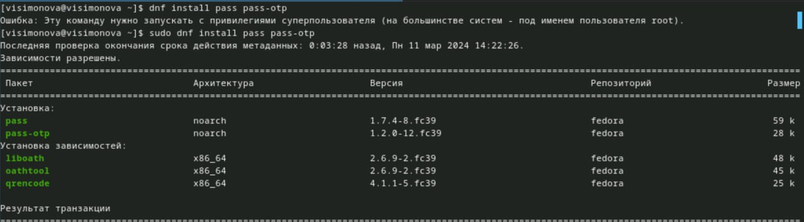

##

Устанавливаю gopass 

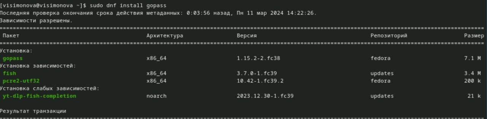

##

Просмотр списка ключей. Инициализация хранилища. Создание структуры git 

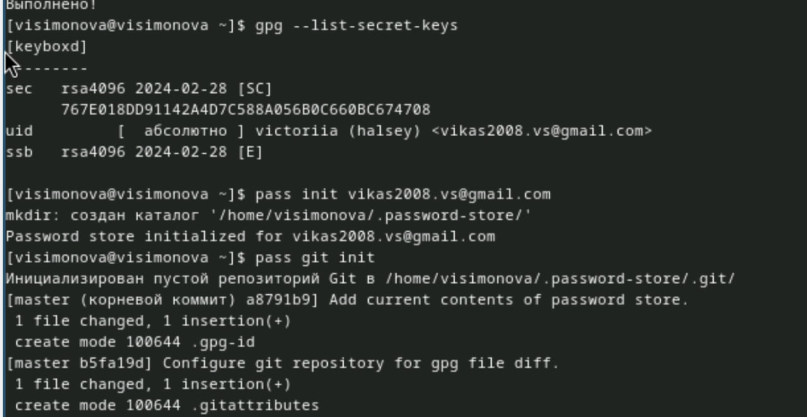

##

Задаю адрес репозитория на хостинге, предварительно создав его 

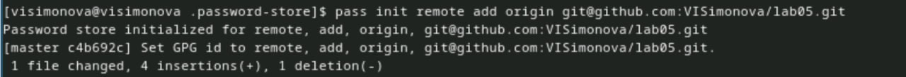

##

Инициализирую удалённый репозиторий и синхронизирую его с локальным, создавая новую ветку master 

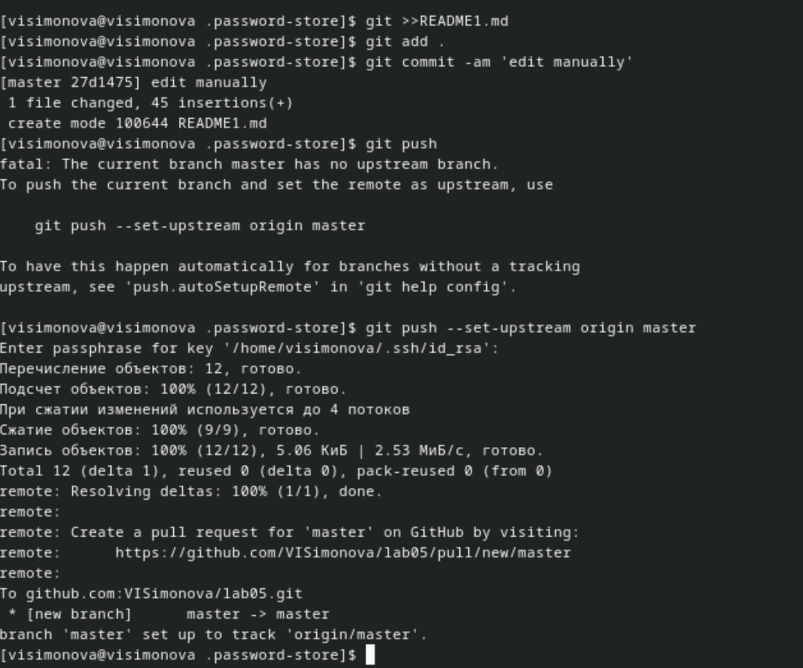

##

Проверяю, что изменения успешно пренеслись в удалённый репозиторий 

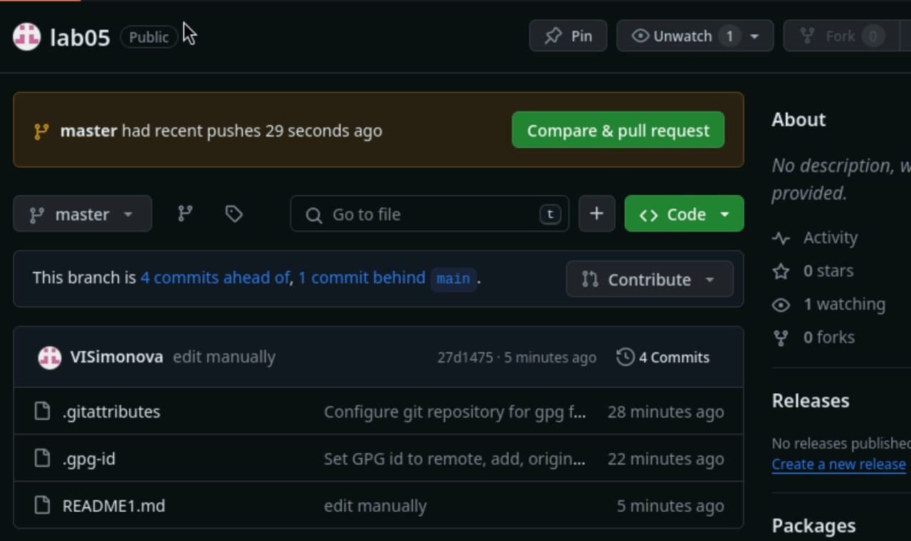

##

Проверяю статус синхронизации 

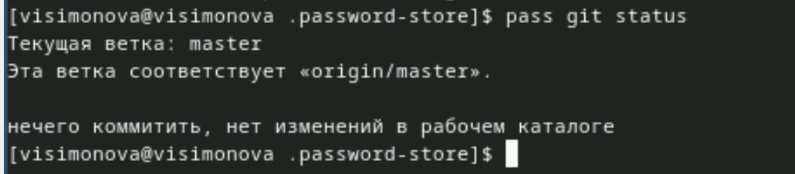

##

Устанавливаю программу, обеспечивающую интерфейс native messaging. 

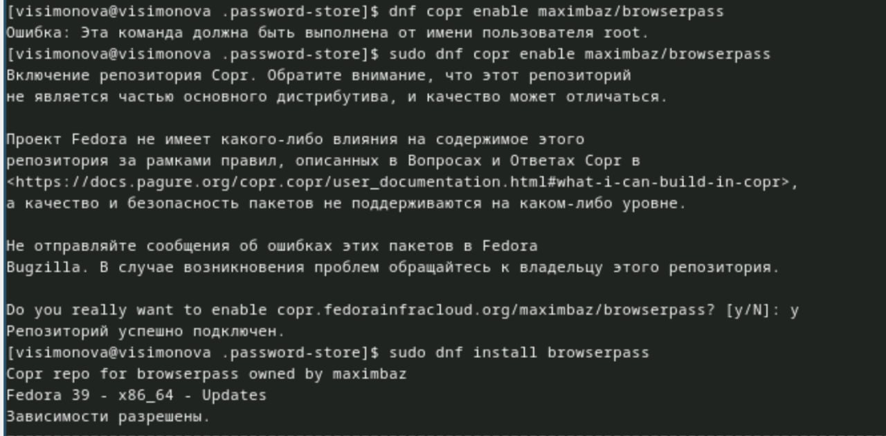

##

Устанавливаю дополнительное ПО 

##

Установка шрифтов 

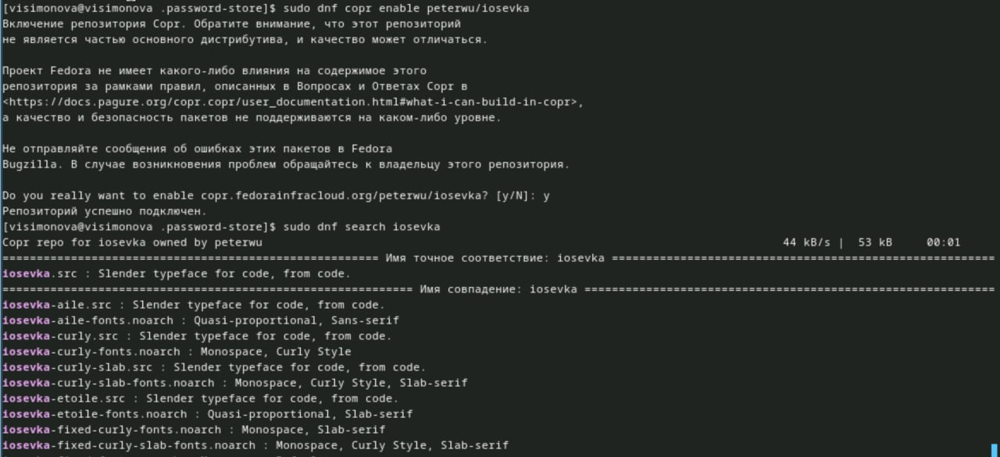

##

Установка шрифтов 

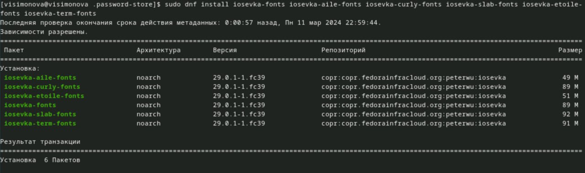

##

Установка бинарного файла. Скрипт определяет архитектуру процессора и операционную систему и скачивает необходимый файл 

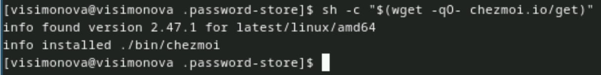

##

Создание собственного репозитория с помощью утилит 

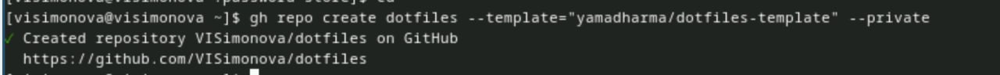

##

Инициализирую chezmoi с моим репозиторием dotfiles. Проверяю, какие изменения внесёт chezmoi в домашний каталог, запустив: chezmoi diff 

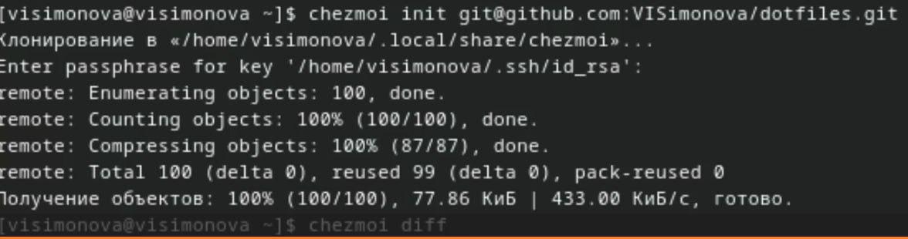

##

Так как меня устраивают внесённые изменения запускаю : chezmoi apply -v 

##

Извлекаю последние изменеия из репозитория  и применяю их 

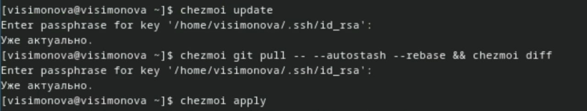

##

Добавляю функцию автоматической фиксации и отправления изменений, исправив файл ~/.config/chezmoi/chezmoi.toml 

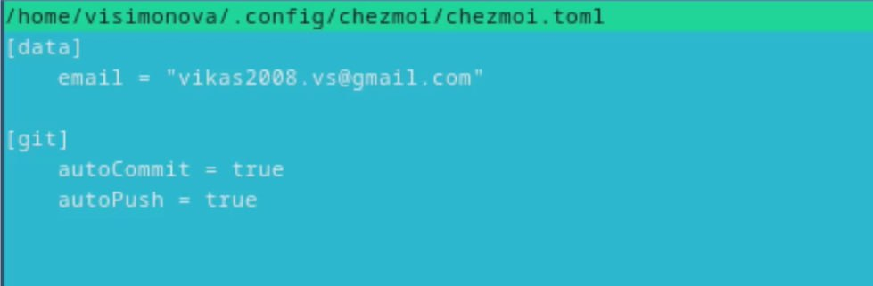

# Выводы

Настроила рабочую среду, создала репозиторий менеджера паролей.

# Список литературы{.unnumbered}

::: {#refs}
:::

1. Dash, P. Getting Started with Oracle VM VirtualBox / P. Dash. – Packt Publishing Ltd, 2013. – 86 сс.
2. Colvin, H. VirtualBox: An Ultimate Guide Book on Virtualization with VirtualBox. VirtualBox / H. Colvin. – CreateSpace Independent Publishing Platform, 2015. – 70 сс.
3. Vugt, S. van. Red Hat RHCSA/RHCE 7 cert guide : Red Hat Enterprise Linux 7 (EX200 and EX300) : Certification Guide. Red Hat RHCSA/RHCE 7 cert guide / S. van Vugt. – Pearson IT Certification, 2016. – 1008 сс.
4. Робачевский, А. Операционная система UNIX / А. Робачевский, С. Немнюгин, О. Стесик. – 2-е изд. – Санкт-Петербург : БХВ-Петербург, 2010. – 656 сс.
5. Немет, Э. Unix и Linux: руководство системного администратора. Unix и Linux / Э. Немет, Г. Снайдер, Т.Р. Хейн, Б. Уэйли. – 4-е изд. – Вильямс, 2014. – 1312 сс.
6. Колисниченко, Д.Н. Самоучитель системного администратора Linux : Системный администратор / Д.Н. Колисниченко. – Санкт-Петербург : БХВ-Петербург, 2011. – 544 сс.
7. Robbins, A. Bash Pocket Reference / A. Robbins. – O’Reilly Media, 2016. – 156 сс.

