---
## Front matter
title: "Отчёт по лабораторной работе №5"
subtitle: ""
author: "Симонова Виктория Игоревна"

## Generic otions
lang: ru-RU
toc-title: "Содержание"

## Bibliography
bibliography: bib/cite.bib
csl: pandoc/csl/gost-r-7-0-5-2008-numeric.csl

## Pdf output format
toc: true # Table of contents
toc-depth: 2
lof: true # List of figures
lot: true # List of tables
fontsize: 12pt
linestretch: 1.5
papersize: a4
documentclass: scrreprt
## I18n polyglossia
polyglossia-lang:
  name: russian
  options:
	- spelling=modern
	- babelshorthands=true
polyglossia-otherlangs:
  name: english
## I18n babel
babel-lang: russian
babel-otherlangs: english
## Fonts
mainfont: PT Serif
romanfont: PT Serif
sansfont: PT Sans
monofont: PT Mono
mainfontoptions: Ligatures=TeX
romanfontoptions: Ligatures=TeX
sansfontoptions: Ligatures=TeX,Scale=MatchLowercase
monofontoptions: Scale=MatchLowercase,Scale=0.9
## Biblatex
biblatex: true
biblio-style: "gost-numeric"
biblatexoptions:
  - parentracker=true
  - backend=biber
  - hyperref=auto
  - language=auto
  - autolang=other*
  - citestyle=gost-numeric
## Pandoc-crossref LaTeX customization
figureTitle: "Рис."
tableTitle: "Таблица"
listingTitle: "Листинг"
lofTitle: "Список иллюстраций"
lotTitle: "Список таблиц"
lolTitle: "Листинги"
## Misc options
indent: true
header-includes:
  - \usepackage{indentfirst}
  - \usepackage{float} # keep figures where there are in the text
  - \floatplacement{figure}{H} # keep figures where there are in the text
---

# Цель работы

Настройка рабочей среды. Создание репозитория и преобретение навыков для работы с менеджером паролей.

# Задание

1. Настроить менеджер паролей
2. Установить дополнительное ПО

# Теоретическое введение

1. Менеджер паролей pass

* Менеджер паролей pass — программа, сделанная в рамках идеологии Unix.
* Также носит название стандартного менеджера паролей для Unix (The standard Unix password manager).

2. Основные свойства

* Данные хранятся в файловой системе в виде каталогов и файлов.
* Файлы шифруются с помощью GPG-ключа.

3. Структура базы паролей

* Структура базы может быть произвольной, если Вы собираетесь использовать её напрямую, без промежуточного программного обеспечения. Тогда семантику структуры базы данных Вы держите в своей голове.
* Если же необходимо использовать дополнительное программное обеспечение, необходимо семантику заложить в структуру базы паролей.

4. Семантическая структура базы паролей

* Рассмотрим пользователя user в домене example.com, порт 22.
* Отсутствие имени пользователя или порта в имени файла означает, что любое имя пользователя и порт будут совпадать:
* example.com.pgp
* Соответствующее имя пользователя может быть именем файла внутри каталога, имя которого совпадает с хостом. Это полезно, если в базе есть пароли для нескольких пользователей на одном хосте:
* example.com/user.pgp
* Имя пользователя также может быть записано в виде префикса, отделенного от хоста знаком @:
* user@example.com.pgp
* Соответствующий порт может быть указан после хоста, отделённый двоеточием (:):
* example.com:22.pgp
* example.com:22/user.pgp
* user@example.com:22.pgp
* Эти все записи могут быть расположены в произвольных каталогах, задающих Вашу собственную иерархию.

# Выполнение лабораторной работы

Устанавливаю менеджер паролей pass (рис. [-@fig:001]).

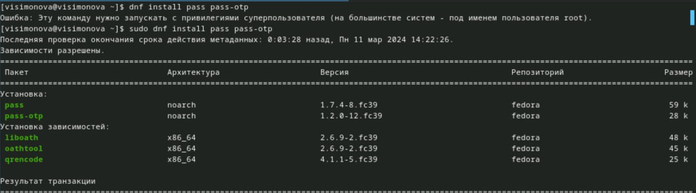{#fig:001 width=70%}

Устанавливаю gopass (рис. [-@fig:002]).

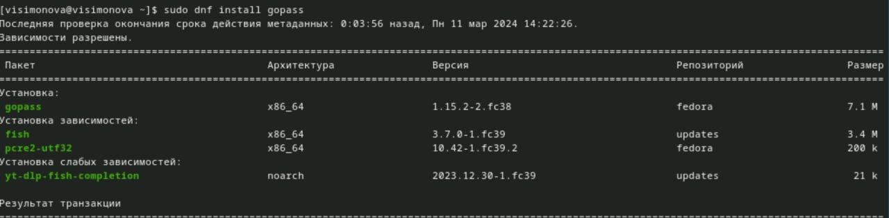{#fig:002 width=70%}

Просмотр списка ключей. Инициализация хранилища. Создание структуры git (рис. [-@fig:003]).

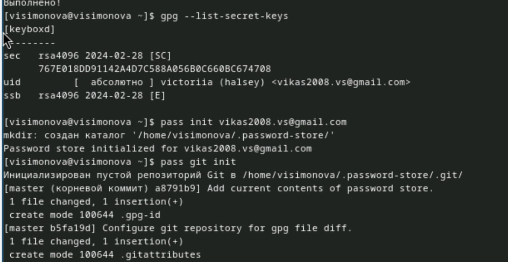{#fig:003 width=70%}

Задаю адрес репозитория на хостинге, предварительно создав его (рис. [-@fig:004]).

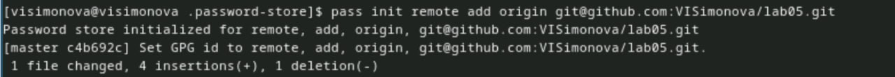{#fig:004 width=70%}

Инициализирую удалённый репозиторий и синхронизирую его с локальным, создавая новую ветку master (рис. [-@fig:005]).

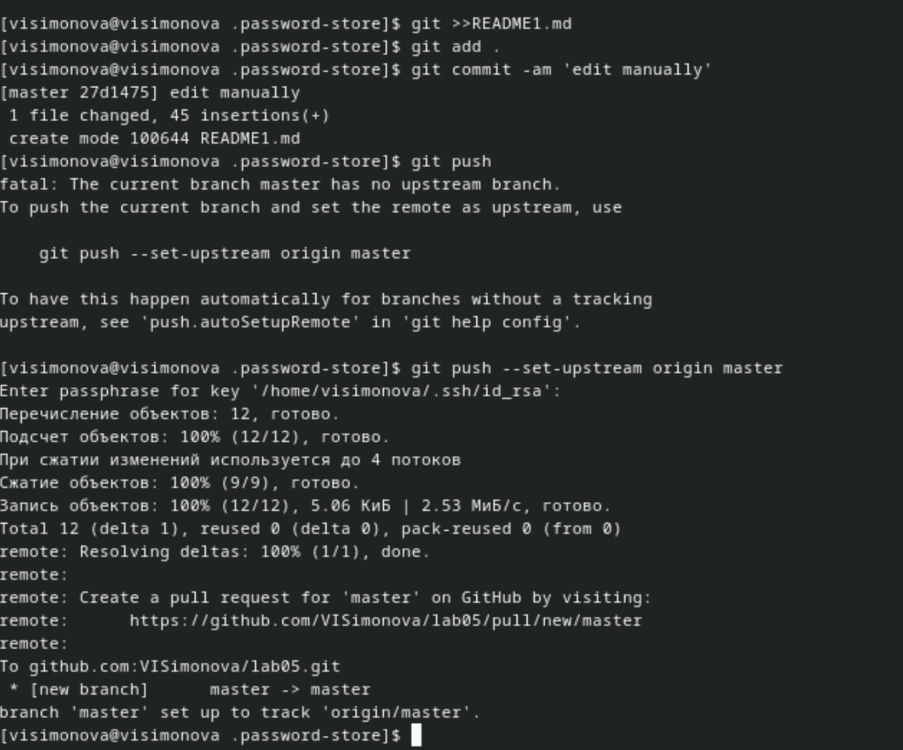{#fig:005 width=70%}

Проверяю, что изменения успешно пренеслись в удалённый репозиторий (рис. [-@fig:006]).

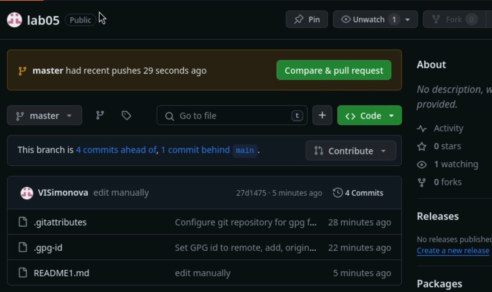{#fig:006 width=70%}

Проверяю статус синхронизации (рис. [-@fig:007]).

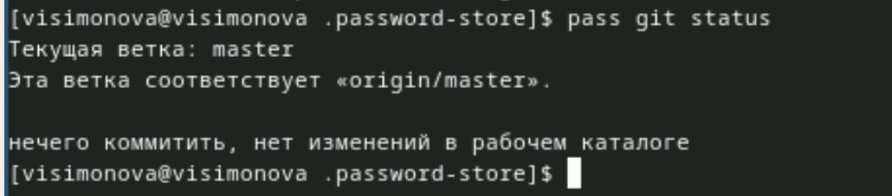{#fig:007 width=70%}

Устанавливаю программу, обеспечивающую интерфейс native messaging. (рис. [-@fig:008]).

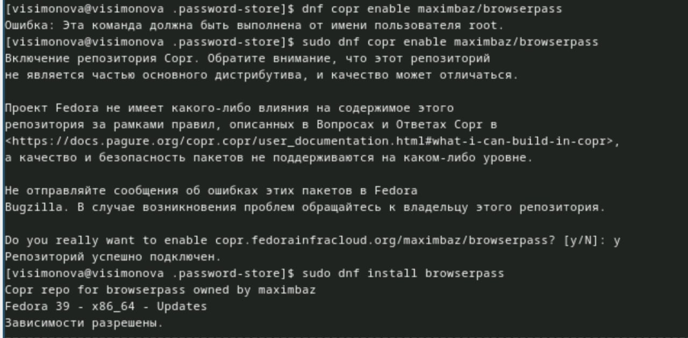{#fig:008 width=70%}

Устанавливаю дополнительное ПО (рис. [-@fig:009]).

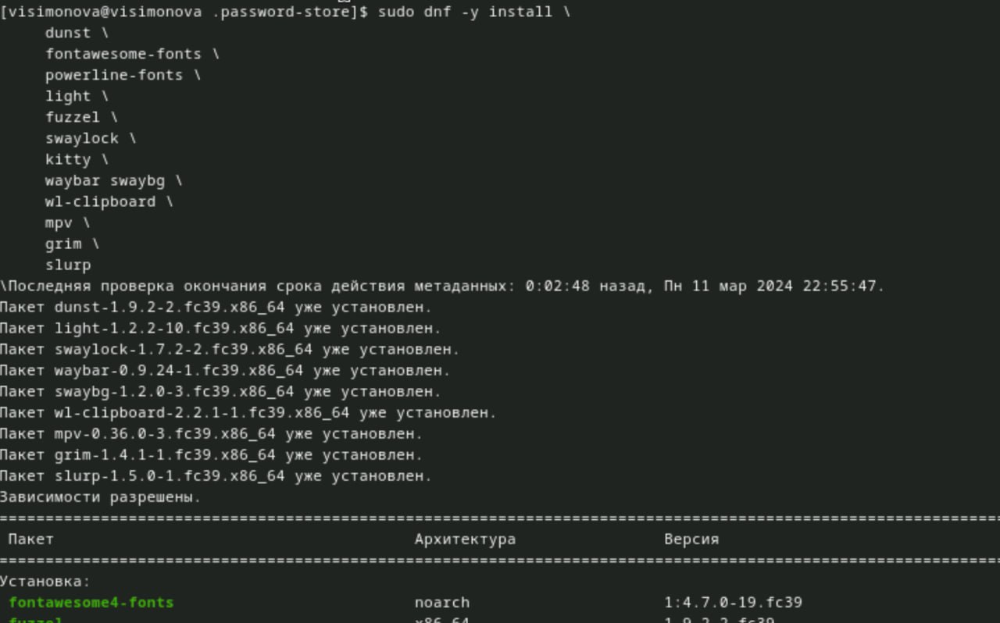{#fig:009 width=70%}

Установка шрифтов (рис. [-@fig:010]).

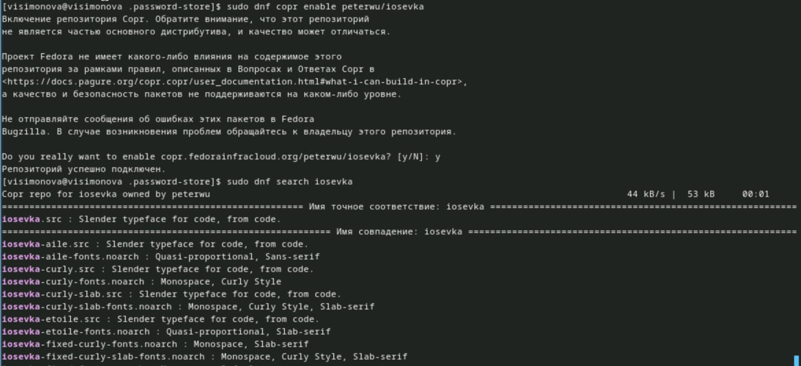{#fig:010 width=70%}

Установка шрифтов (рис. [-@fig:011]).

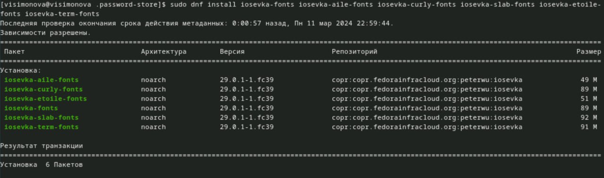{#fig:011 width=70%}

Установка бинарного файла. Скрипт определяет архитектуру процессора и операционную систему и скачивает необходимый файл (рис. [-@fig:012]).

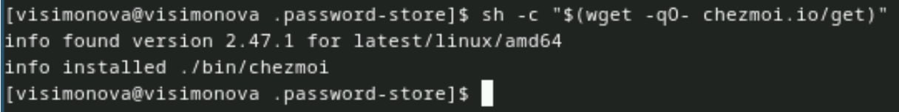{#fig:012 width=70%}

Создание собственного репозитория с помощью утилит (рис. [-@fig:013]).

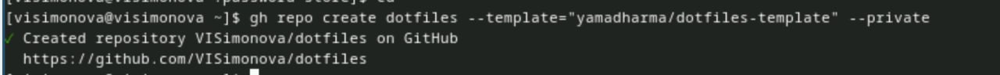{#fig:013 width=70%}

Инициализирую chezmoi с моим репозиторием dotfiles. Проверяю, какие изменения внесёт chezmoi в домашний каталог, запустив: chezmoi diff (рис. [-@fig:014]).

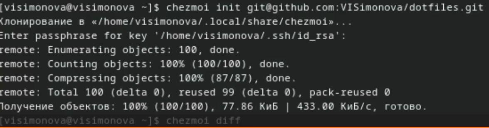{#fig:014 width=70%}

Так как меня устраивают внесённые изменения запускаю : chezmoi apply -v (рис. [-@fig:015]).

{#fig:015 width=70%}

Извлекаю последние изменеия из репозитория  и применяю их (рис. [-@fig:016]).

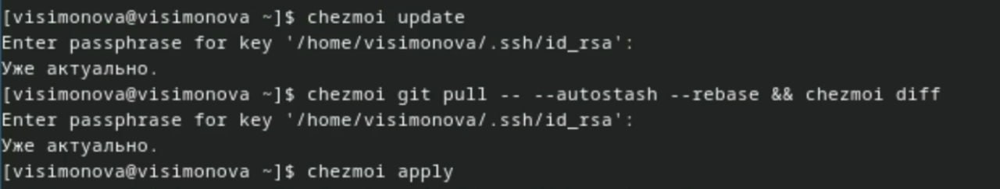{#fig:016 width=70%}

Добавляю функцию автоматической фиксации и отправления изменений, исправив файл ~/.config/chezmoi/chezmoi.toml (рис. [-@fig:017]).

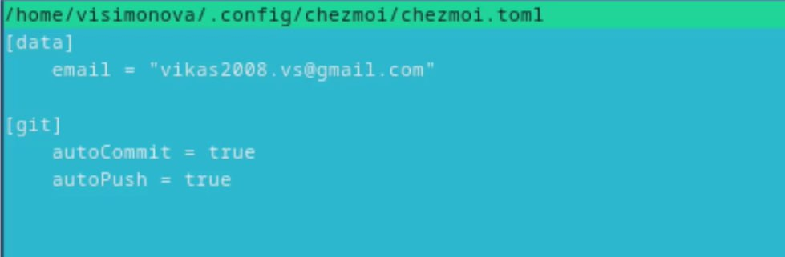{#fig:017 width=70%}

# Выводы

Настроила рабочую среду, создала репозиторий менеджера паролей.

# Список литературы{.unnumbered}

::: {#refs}
:::

1. Dash, P. Getting Started with Oracle VM VirtualBox / P. Dash. – Packt Publishing Ltd, 2013. – 86 сс.
2. Colvin, H. VirtualBox: An Ultimate Guide Book on Virtualization with VirtualBox. VirtualBox / H. Colvin. – CreateSpace Independent Publishing Platform, 2015. – 70 сс.
3. Vugt, S. van. Red Hat RHCSA/RHCE 7 cert guide : Red Hat Enterprise Linux 7 (EX200 and EX300) : Certification Guide. Red Hat RHCSA/RHCE 7 cert guide / S. van Vugt. – Pearson IT Certification, 2016. – 1008 сс.
4. Робачевский, А. Операционная система UNIX / А. Робачевский, С. Немнюгин, О. Стесик. – 2-е изд. – Санкт-Петербург : БХВ-Петербург, 2010. – 656 сс.
5. Немет, Э. Unix и Linux: руководство системного администратора. Unix и Linux / Э. Немет, Г. Снайдер, Т.Р. Хейн, Б. Уэйли. – 4-е изд. – Вильямс, 2014. – 1312 сс.
6. Колисниченко, Д.Н. Самоучитель системного администратора Linux : Системный администратор / Д.Н. Колисниченко. – Санкт-Петербург : БХВ-Петербург, 2011. – 544 сс.
7. Robbins, A. Bash Pocket Reference / A. Robbins. – O’Reilly Media, 2016. – 156 сс.
