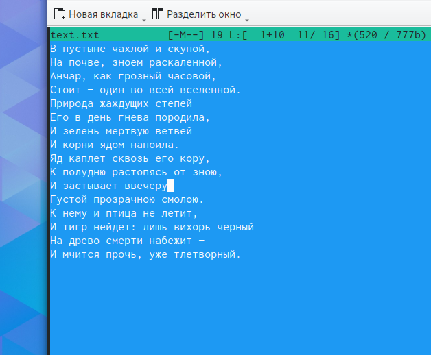
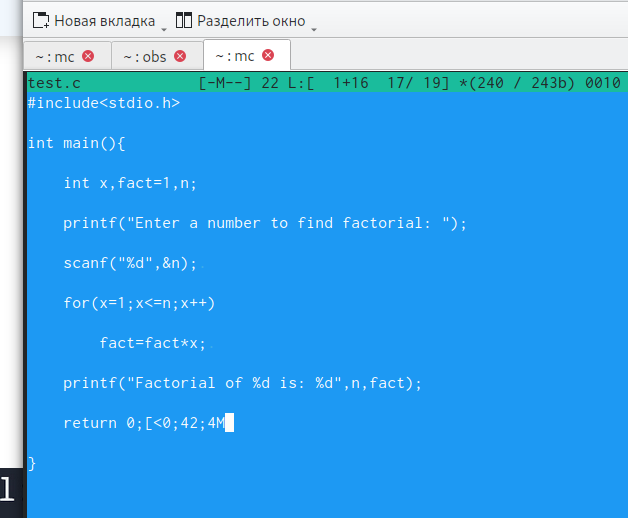
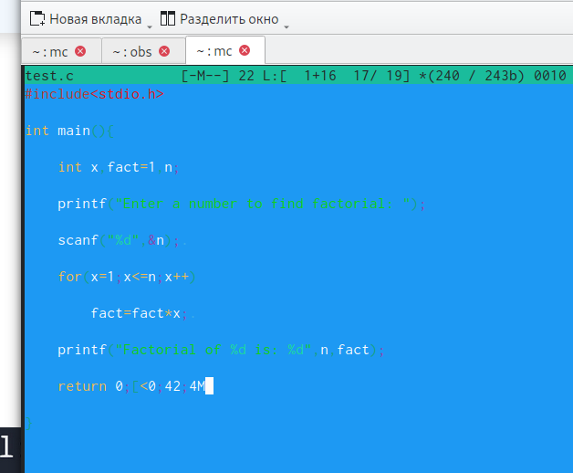

---
## Front matter
title: "Шаблон отчёта по лабораторной работе"
subtitle: "Простейший вариант"
author: "Карпачев Ярослав Олегович"

## Generic otions
lang: ru-RU
toc-title: "Содержание"

## Bibliography
bibliography: bib/cite.bib
csl: pandoc/csl/gost-r-7-0-5-2008-numeric.csl

## Pdf output format
toc: true # Table of contents
toc-depth: 2
lof: true # List of figures
lot: true # List of tables
fontsize: 12pt
linestretch: 1.5
papersize: a4
documentclass: scrreprt
## I18n polyglossia
polyglossia-lang:
  name: russian
  options:
	- spelling=modern
	- babelshorthands=true
polyglossia-otherlangs:
  name: english
## I18n babel
babel-lang: russian
babel-otherlangs: english
## Fonts
mainfont: PT Serif
romanfont: PT Serif
sansfont: PT Sans
monofont: PT Mono
mainfontoptions: Ligatures=TeX
romanfontoptions: Ligatures=TeX
sansfontoptions: Ligatures=TeX,Scale=MatchLowercase
monofontoptions: Scale=MatchLowercase,Scale=0.9
## Biblatex
biblatex: true
biblio-style: "gost-numeric"
biblatexoptions:
  - parentracker=true
  - backend=biber
  - hyperref=auto
  - language=auto
  - autolang=other*
  - citestyle=gost-numeric
## Pandoc-crossref LaTeX customization
figureTitle: "Рис."
tableTitle: "Таблица"
listingTitle: "Листинг"
lofTitle: "Список иллюстраций"
lotTitle: "Список таблиц"
lolTitle: "Листинги"
## Misc options
indent: true
header-includes:
  - \usepackage{indentfirst}
  - \usepackage{float} # keep figures where there are in the text
  - \floatplacement{figure}{H} # keep figures where there are in the text
---

# Цель работы

Освоение основных возможностей командной оболочки Midnight Commander. Приоб-
ретение навыков практической работы по просмотру каталогов и файлов; манипуляций
с ними

# Задание

1. Создайте текстовой файл text.txt.
2. Откройте этот файл с помощью встроенного в mc редактора.
3. Вставьте в открытый файл небольшой фрагмент текста, скопированный из любого
другого файла или Интернета.
4. Проделайте с текстом следующие манипуляции, используя горячие клавиши:
4.1. Удалите строку текста.
4.2. Выделите фрагмент текста и скопируйте его на новую строку.
Кулябов Д. С. и др. Операционные системы 69
4.3. Выделите фрагмент текста и перенесите его на новую строку.
4.4. Сохраните файл.
4.5. Отмените последнее действие.
4.6. Перейдите в конец файла (нажав комбинацию клавиш) и напишите некоторый
текст.
4.7. Перейдите в начало файла (нажав комбинацию клавиш) и напишите некоторый
текст.
4.8. Сохраните и закройте файл.
5. Откройте файл с исходным текстом на некотором языке программирования (напри-
мер C или Java)
6. Используя меню редактора, включите подсветку синтаксиса, если она не включена,
или выключите, если она включена.

# Выполнение лаболаторной работы

1. Создаем файл text, и вставляем Анчар пушкина (рис. [-@fig:001]).

{#fig:001 width=70%}

2. Проводим действия с текстов, по окончанию работы он выглядит так:(рис. [-@fig:002]).

{#fig:002 width=70%}

3. вставляем программу факториал на с в другой вайл включаем и выключаем синтаксис.(рис. [-@fig:003]).(рис. [-@fig:004]).

{#fig:003 width=70%}

{#fig:004 width=70%}

# Контрольные вопросы

1. Режимы работы в mc
Midnight Commander работает в основном в двух режимах:

Просмотрщик файлов (Viewer): Позволяет пользователю просматривать содержимое файлов, не покидая mc. Доступен для текстовых файлов, а также для некоторых типов бинарных файлов и документов в определённых форматах.
Редактор файлов (Editor): Встроенный текстовый редактор mc, mcedit, позволяет редактировать файлы непосредственно из mc. Он поддерживает синтаксическую подсветку для многих языков программирования, поиск и замену текста, макросы и другие функции текстового редактора.
2. Операции с файлами в mc
Операции с файлами в mc можно выполнять как с использованием команд shell, так и через меню или горячие клавиши. Некоторые примеры:

Копирование файлов: можно использовать команду cp в командной строке или выбрать "Копировать" из меню/нажать F5.
Перемещение/переименование файлов: используйте команду mv или выберите "Переместить/Переименовать" из меню/нажмите F6.
Удаление файлов: команда rm или выбрать "Удалить" из меню/нажать F8.
Просмотр файлов: можно открыть файл во встроенном просмотрщике с помощью F3.
3. Структура меню панели mc
Каждая панель в mc (левая и правая) имеет своё меню, которое активируется клавишей F9, после чего можно выбрать раздел меню, например, "Файл", "Правка", "Вид" и так далее. Каждый раздел содержит команды для работы с файлами и каталогами, настройки отображения и другие функции.

4-6. Структура меню Файл, Правка и другие
Файл: содержит команды для создания, открытия, копирования, перемещения, удаления файлов и каталогов, а также для работы с архивами.
Правка: предоставляет инструменты для работы с файлами, такие как копирование, перемещение, переименование и поиск файлов.
Остальные меню (Вид, Команды, Настройки) предлагают различные опции для настройки внешнего вида mc, доступа к встроенным инструментам (например, подключение к удалённым серверам через FTP) и изменения конфигурации mc.
7. Встроенные команды mc
Midnight Commander включает множество встроенных команд, таких как:

mcedit: открытие встроенного редактора.
mcview: открытие встроенного просмотрщика.
Команды для работы с архивами: mc позволяет просматривать содержимое архивов и работать с файлами внутри них, используя внешние утилиты для архивации/разархивации.
8. Команды встроенного редактора mc
Встроенный редактор, mcedit, предлагает команды для:

Текстового редактирования: вставка, удаление, копирование и перемещение текста.
Поиска и замены текста.
Сохранения изменений и открытия новых файлов для редактирования.
Синтаксической подсветки для различных языков программирования.
9-10. Средства mc для создания пользовательских меню и действий
Создание пользовательских меню: mc позволяет создавать пользовательские меню для быстрого доступа к часто используемым командам и скриптам через файл .mc/menu.
Выполнение пользовательских действий: пользователи могут настроить собственные горячие клавиши для выполнения специализированных действий с файлами или запуска внешних приложений через файл .mc/bindings.
Эти возможности делают mc мощным инструментом для управления файлами в UNIX-подобных операционных системах, предоставляя гибкие настройки для адаптации к потребностям пользователя.

# Выводы

Ознакомился с mc, поработал с ним.

