---
## Front matter
lang: ru-RU
title: Отчёт по 1 этапу индивидуального проекта
subtitle: Операционные системы
author:
  - Симонова В.И.
institute:
  - Российский университет дружбы народов, Москва, Россия
  - НКАбд-05-23
date: 2 марта 2024

## i18n babel
babel-lang: russian
babel-otherlangs: english

## Formatting pdf
toc: false
toc-title: Содержание
slide_level: 2
aspectratio: 169
section-titles: true
theme: metropolis
header-includes:
 - \metroset{progressbar=frametitle,sectionpage=progressbar,numbering=fraction}
 - '\makeatletter'
 - '\beamer@ignorenonframefalse'
 - '\makeatother'

## Fonts
mainfont: PT Serif
romanfont: PT Serif
sansfont: PT Sans
monofont: PT Mono
mainfontoptions: Ligatures=TeX
romanfontoptions: Ligatures=TeX
sansfontoptions: Ligatures=TeX,Scale=MatchLowercase
monofontoptions: Scale=MatchLowercase,Scale=0.9
---

## Докладчик

:::::::::::::: {.columns align=center}
::: {.column width="70%"}

  * Симонова Виктория Игоревна
  * Студент 
  * НКАбд-05-23
  * Российский университет дружбы народов
  * [1132236012@pfur.ru](mailto:1132236012@rudn.ru)

:::
::: {.column width="30%"}

:::
::::::::::::::

# Цель работы

Выполнить первый этап индивидкального проекта, а именно - научиться размещать сайт на github pages.

# Задание

1. Установить необходимое ПО

2. Скачать шаблон темы сайта

3. Разместить его на хостинге git

4. Установить параметра для URLs сайта

5. Разместить заготовку сайта на github pages

# Выполнение этапа идивидуаьлного проекта

## Установка необходимого ПО

Скачиваю последнюю версию файла hugo-extended 

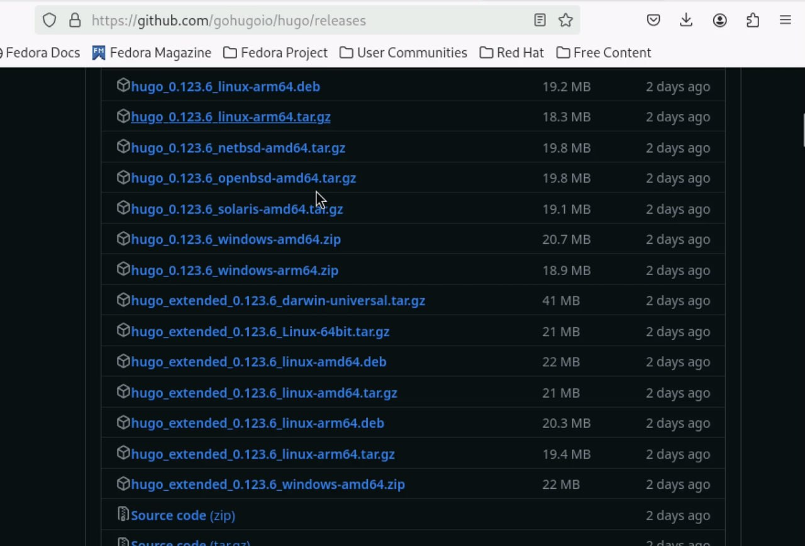

##

Распаковываю архив с помощью команды tar -xvf <file name> и проверяю выполнение 

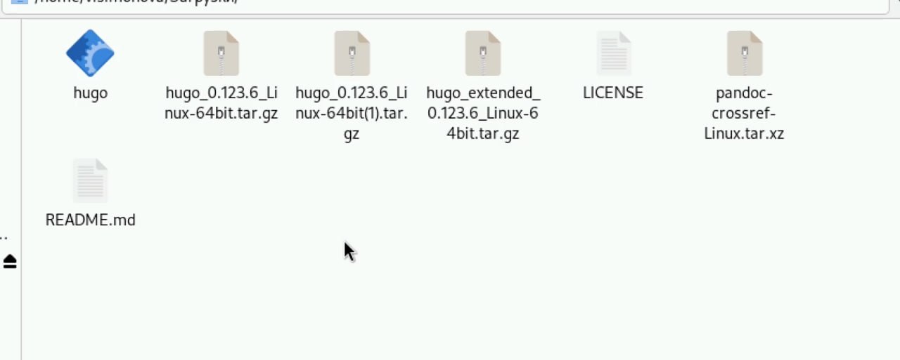

##

Создаю папку bin и размещаю туда файл hugo 

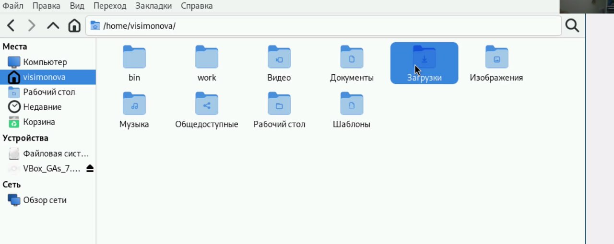

## Скачиваю тему шаблона сайта

Открываю репозиторий с шаблоном 

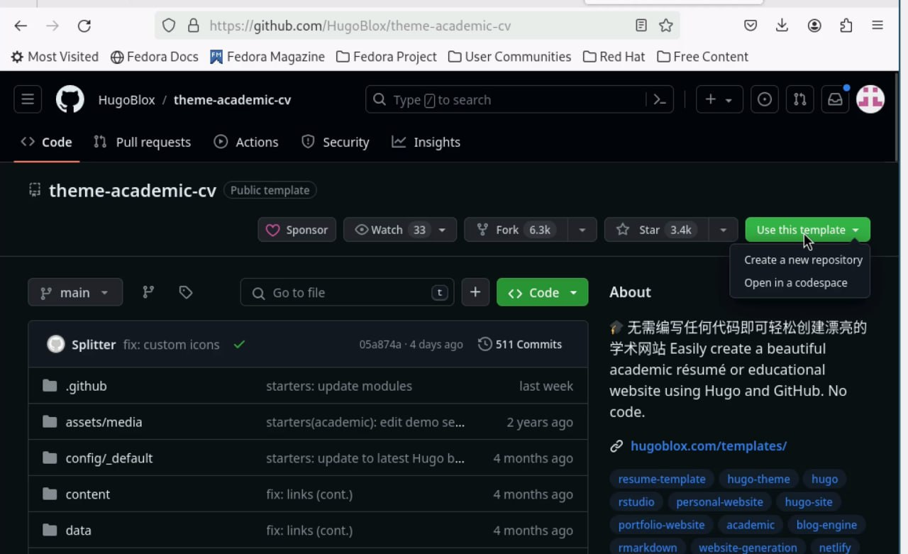

##

Создаю свой репозиторий blog на основе данного шаблона 

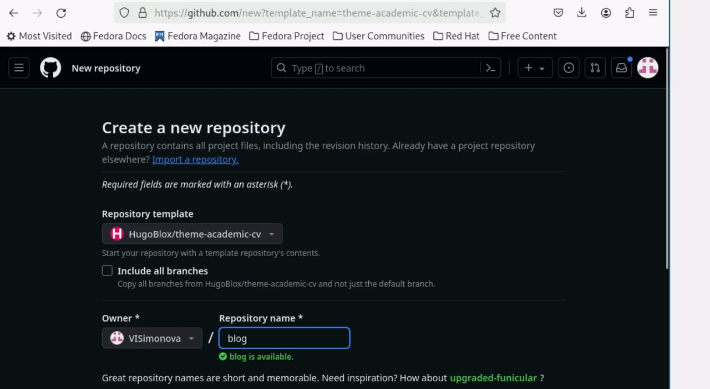

##

Клонирую созданный репозторий и проверяю папки в нём 

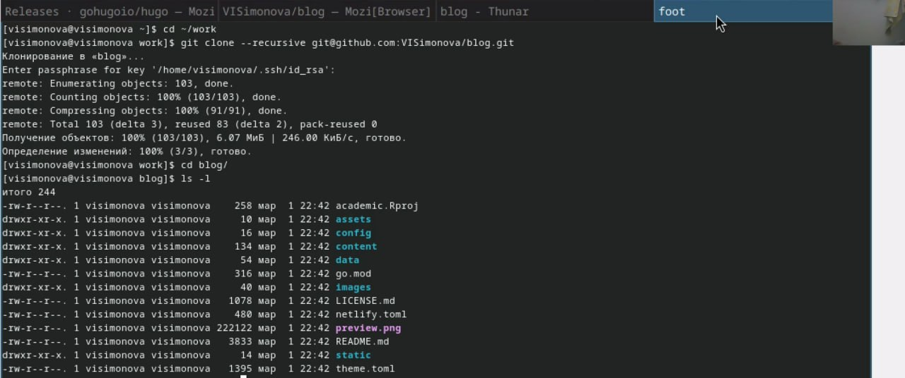

##

Запускаю исполняемый файл и проверяю полученные файлы 

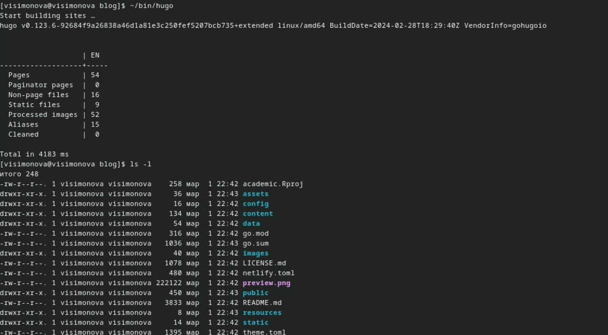

##

Удаляю папку public , тк далее ма создадим совю 

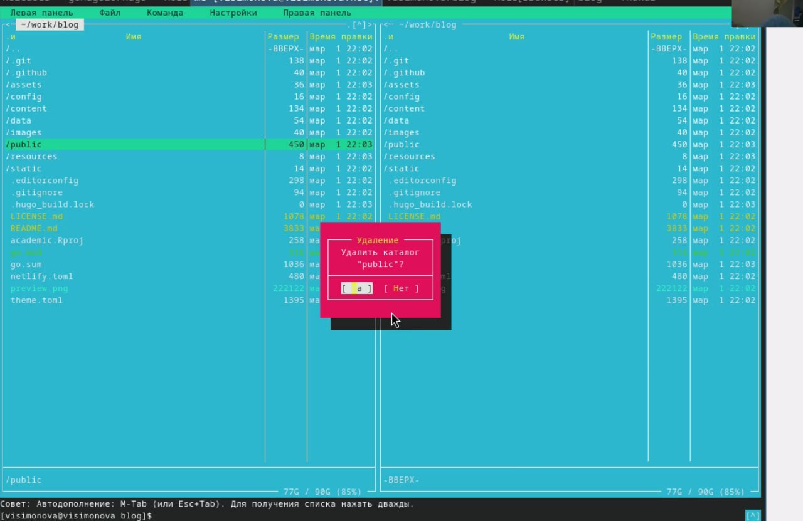

##

Проверяю, что папка была удалена 

##

Запускаю исполняемый файл с командой server копирую ссылку и вставляю в браузер 

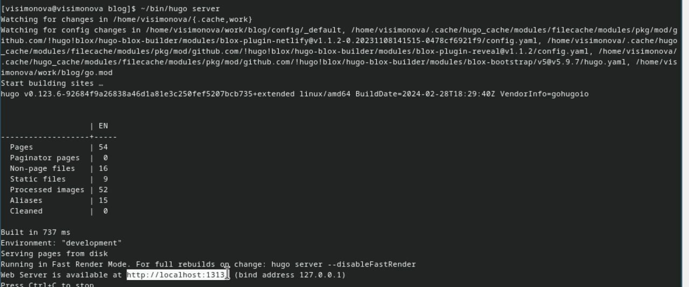

##

Получила страничку файла на локальном сревере 

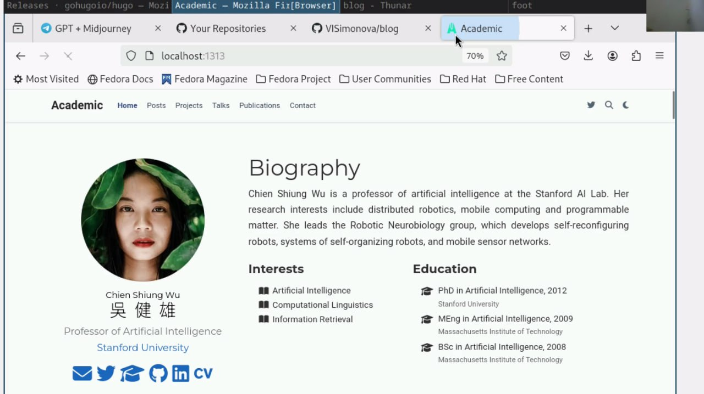

## Установка параметра URLs 

Созадю репозиторий, имя которого станет адресом для сайта 

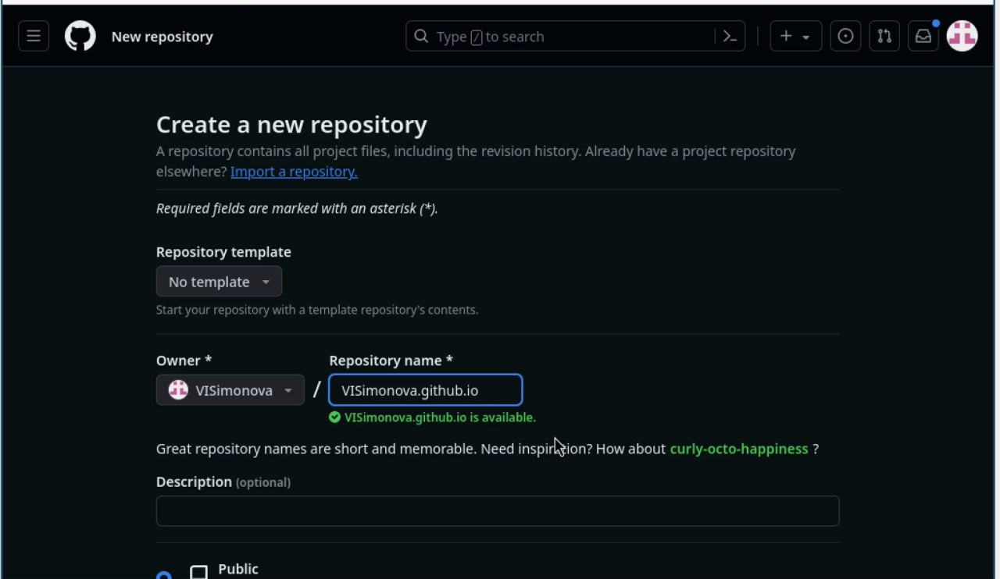

##

Репощиторий создался 

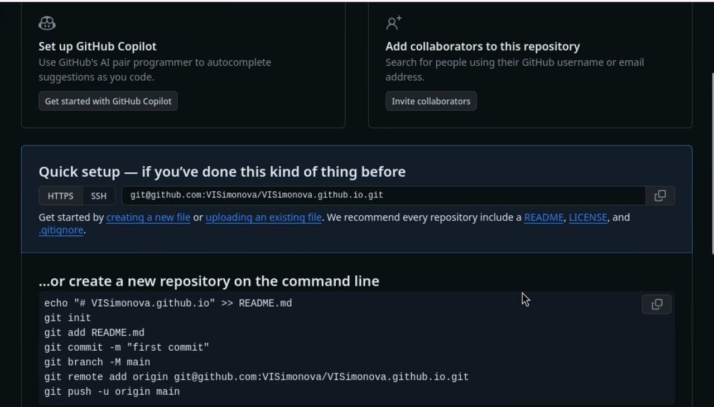

##

Клонирую его и создаю репозиторий у себя на компьютере и проверяю его наличие 

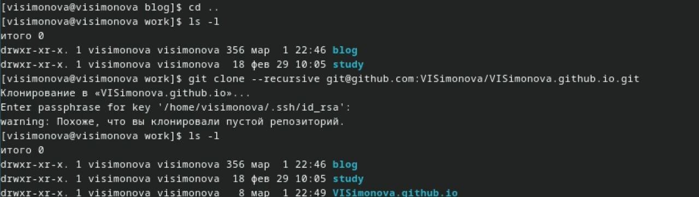

##

Создаю главную ветку с именем main и пустой файл README.md и отправляю всё этов глобальный репозиторий,  чтобы его активировать 

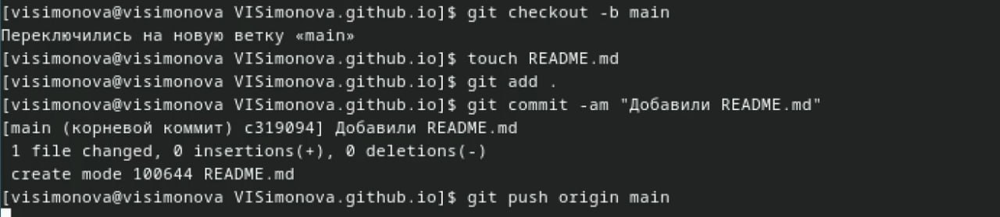

##

Активация репозитория 

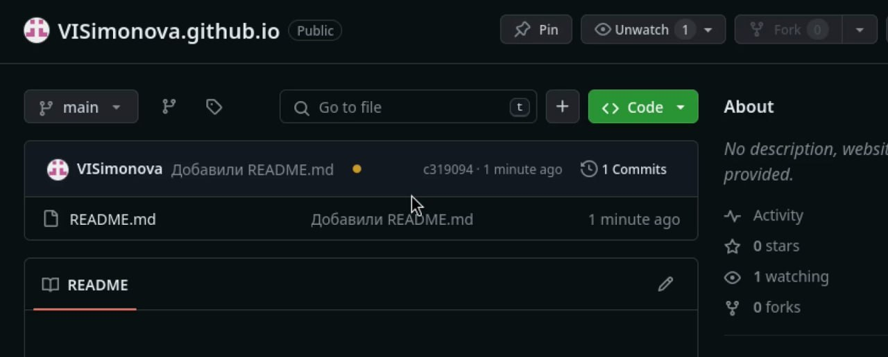

##

Пытаюсь подключить созданный п=репозиторий к папке public 

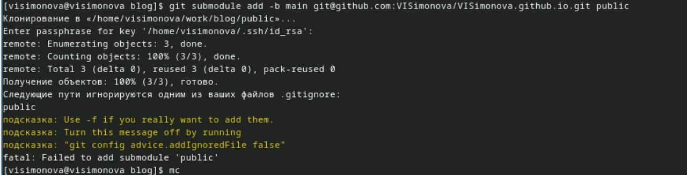

##

Отключаю игнорирование каталогов с названием public 

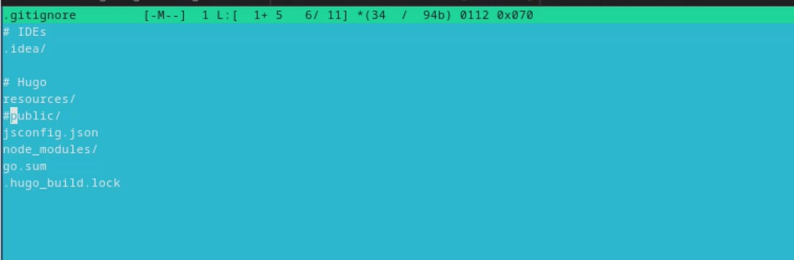

##

Проверяю, что файл изменился и подключаю репозиторий к каталогу public 

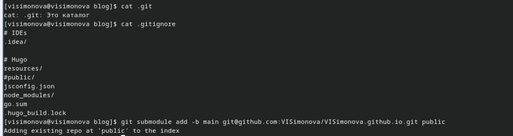

##

Снова запускаю исполняемый файл, чтобы заполнить зозданный каталог 

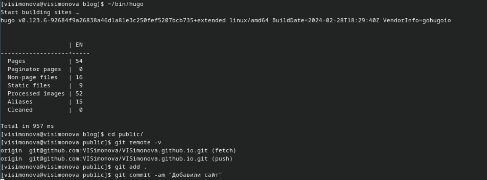

## Размещение заготовки сайта на github pages 

Добавляю изменения в репозиторий 

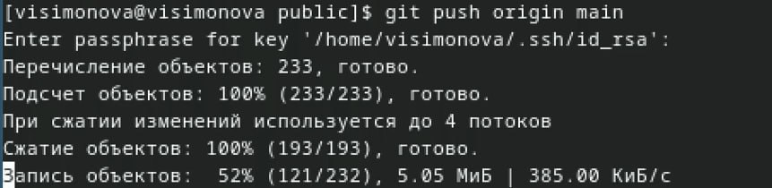

##

Изменения добавились в репозиторий 

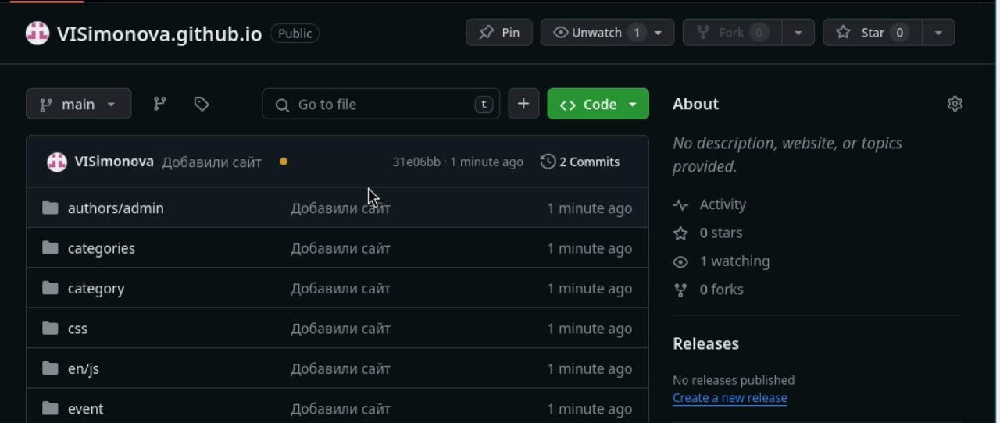

# Выводы

Научилась размещать сайт на github pages и выполнила первый этап реализации индивидуального проекта.

## Список литературы

# Список литературы{.unnumbered}

1. Dash, P. Getting Started with Oracle VM VirtualBox / P. Dash. – Packt Publishing Ltd, 2013. – 86 сс.
2. Colvin, H. VirtualBox: An Ultimate Guide Book on Virtualization with VirtualBox. VirtualBox / H. Colvin. – CreateSpace Independent Publishing Platform, 2015. – 70 сс.
3. Vugt, S. van. Red Hat RHCSA/RHCE 7 cert guide : Red Hat Enterprise Linux 7 (EX200 and EX300) : Certification Guide. Red Hat RHCSA/RHCE 7 cert guide / S. van Vugt. – Pearson IT Certification, 2016. – 1008 сс.
4. Робачевский, А. Операционная система UNIX / А. Робачевский, С. Немнюгин, О. Стесик. – 2-е изд. – Санкт-Петербург : БХВ-Петербург, 2010. – 656 сс.
5. Немет, Э. Unix и Linux: руководство системного администратора. Unix и Linux / Э. Немет, Г. Снайдер, Т.Р. Хейн, Б. Уэйли. – 4-е изд. – Вильямс, 2014. – 1312 сс.
6. Колисниченко, Д.Н. Самоучитель системного администратора Linux : Системный администратор / Д.Н. Колисниченко. – Санкт-Петербург : БХВ-Петербург, 2011. – 544 сс.
7. Robbins, A. Bash Pocket Reference / A. Robbins. – O’Reilly Media, 2016. – 156 сс.