---
## Front matter
title: "Отчёт по 1 этапу индивидуального проекта"
subtitle: "Операционные системы"
author: "Симонова Вивтория Игоревна"

## Generic otions
lang: ru-RU
toc-title: "Содержание"

## Bibliography
bibliography: bib/cite.bib
csl: pandoc/csl/gost-r-7-0-5-2008-numeric.csl

## Pdf output format
toc: true # Table of contents
toc-depth: 2
lof: true # List of figures
lot: true # List of tables
fontsize: 12pt
linestretch: 1.5
papersize: a4
documentclass: scrreprt
## I18n polyglossia
polyglossia-lang:
  name: russian
  options:
	- spelling=modern
	- babelshorthands=true
polyglossia-otherlangs:
  name: english
## I18n babel
babel-lang: russian
babel-otherlangs: english
## Fonts
mainfont: PT Serif
romanfont: PT Serif
sansfont: PT Sans
monofont: PT Mono
mainfontoptions: Ligatures=TeX
romanfontoptions: Ligatures=TeX
sansfontoptions: Ligatures=TeX,Scale=MatchLowercase
monofontoptions: Scale=MatchLowercase,Scale=0.9
## Biblatex
biblatex: true
biblio-style: "gost-numeric"
biblatexoptions:
  - parentracker=true
  - backend=biber
  - hyperref=auto
  - language=auto
  - autolang=other*
  - citestyle=gost-numeric
## Pandoc-crossref LaTeX customization
figureTitle: "Рис."
tableTitle: "Таблица"
listingTitle: "Листинг"
lofTitle: "Список иллюстраций"
lotTitle: "Список таблиц"
lolTitle: "Листинги"
## Misc options
indent: true
header-includes:
  - \usepackage{indentfirst}
  - \usepackage{float} # keep figures where there are in the text
  - \floatplacement{figure}{H} # keep figures where there are in the text
---

# Цель работы

Выполнить первый этап индивидкального проекта, а именно - научиться размещать сайт на github pages.

# Задание

1. Установить необходимое ПО

2. Скачать шаблон темы сайта

3. Разместить его на хостинге git

4. Установить параметра для URLs сайта

5. Разместить заготовку сайта на github pages

# Выполнение этапа идивидуаьлного проекта

## Установка необходимого ПО

Скачиваю последнюю версию файла hugo-extended (рис. [-@fig:001]).

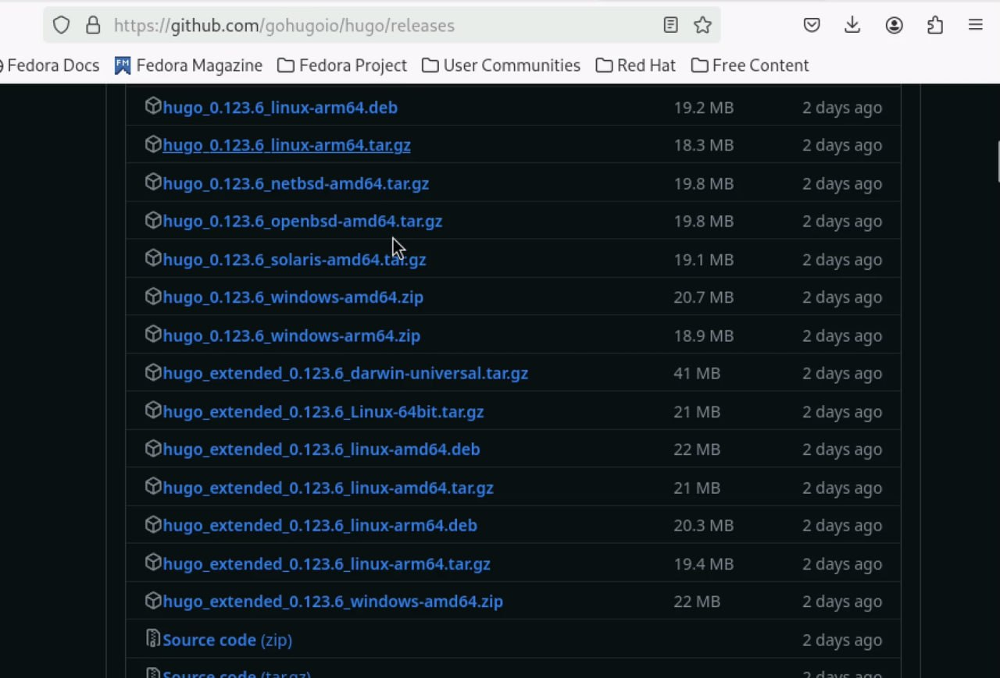{#fig:001 width=70%}

Распаковываю архив с помощью команды tar -xvf <file name> и проверяю выполнение (рис. [-@fig:002]).

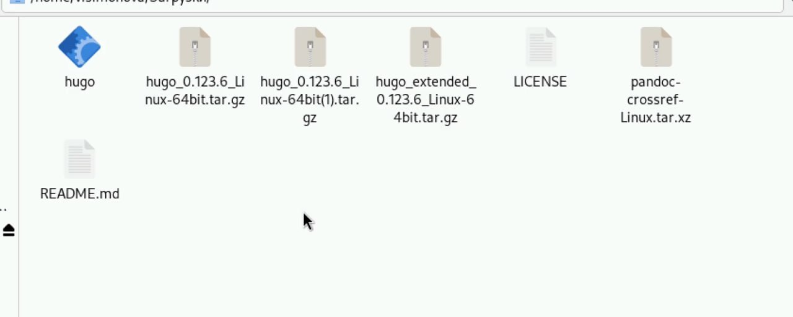{#fig:002 width=70%}

Создаю папку bin и размещаю туда файл hugo (рис. [-@fig:003]).

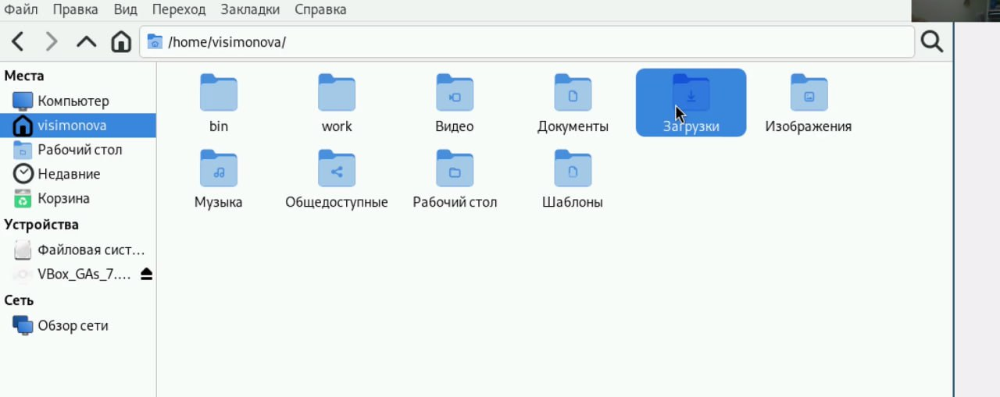{#fig:003 width=70%}

## Скачиваю тему шаблона сайта

Открываю репозиторий с шаблоном (рис. [-@fig:004]).

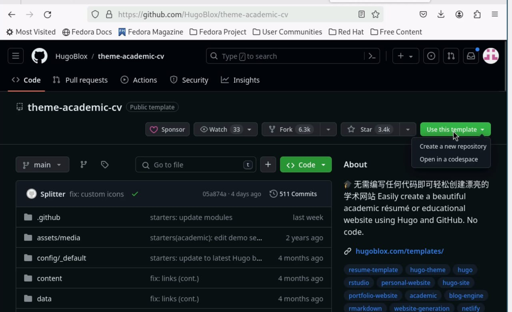{#fig:004 width=70%}

Создаю свой репозиторий blog на основе данного шаблона (рис. [-@fig:005]).

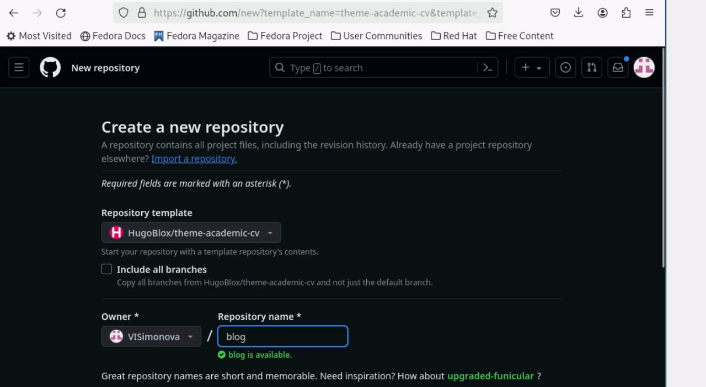{#fig:005 width=70%}

Клонирую созданный репозторий и проверяю папки в нём (рис. [-@fig:006]).

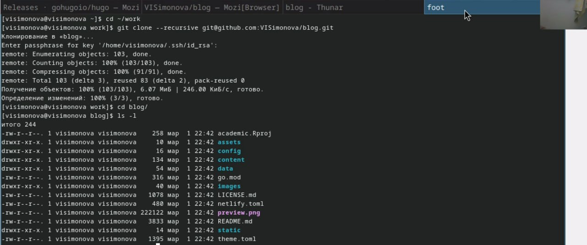{#fig:006 width=70%}

Запускаю исполняемый файл и проверяю полученные файлы (рис. [-@fig:007]).

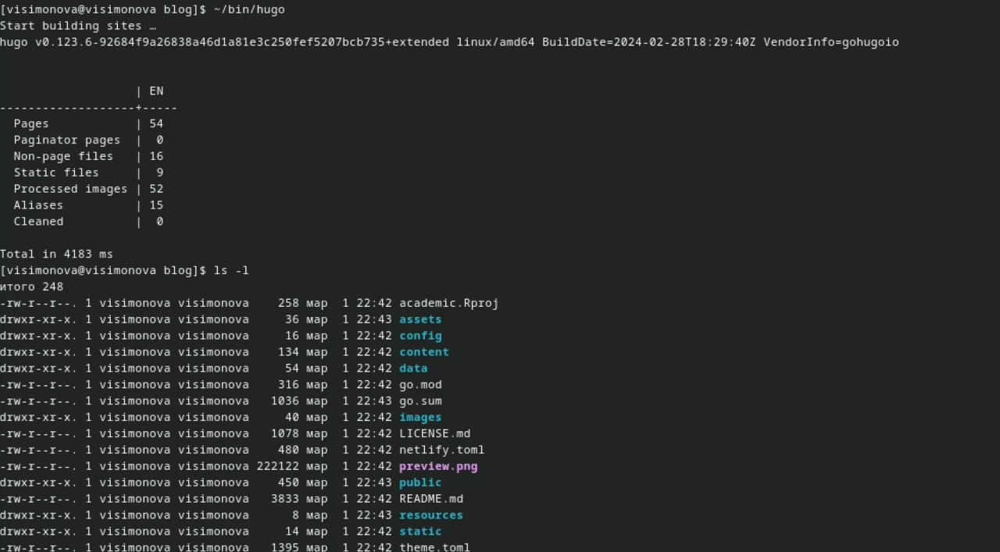{#fig:007 width=70%}

Удаляю папку public , тк далее ма создадим совю (рис. [-@fig:008]).

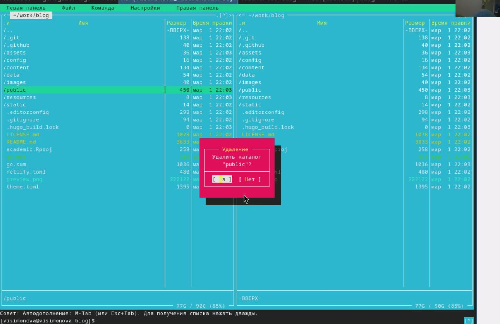{#fig:008 width=70%}

Проверяю, что папка была удалена (рис. [-@fig:009]).

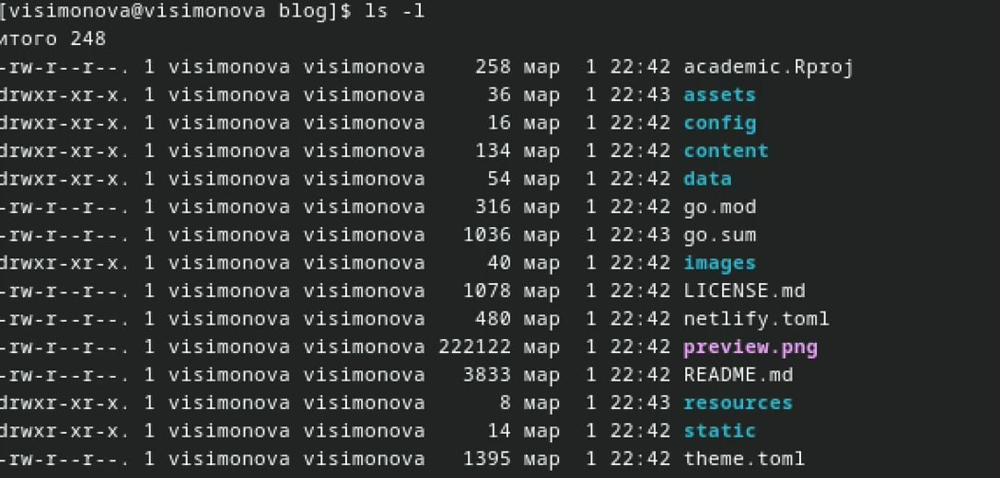{#fig:009 width=70%}

Запускаю исполняемый файл с командой server копирую ссылку и вставляю в браузер (рис. [-@fig:010]).

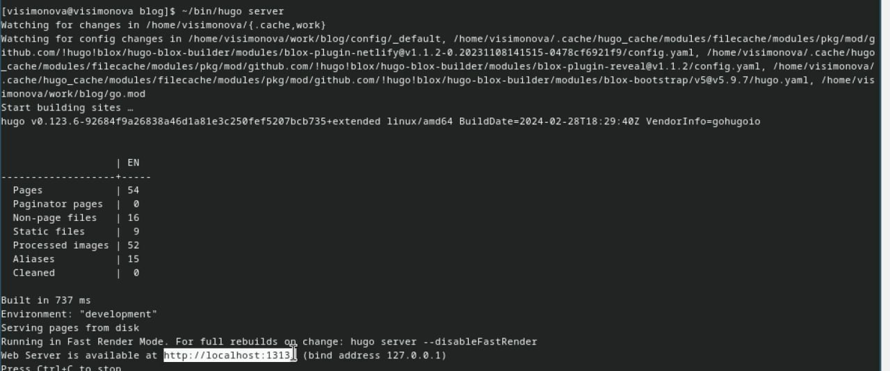{#fig:010 width=70%}

Получила страничку файла на локальном сревере (рис. [-@fig:011]).

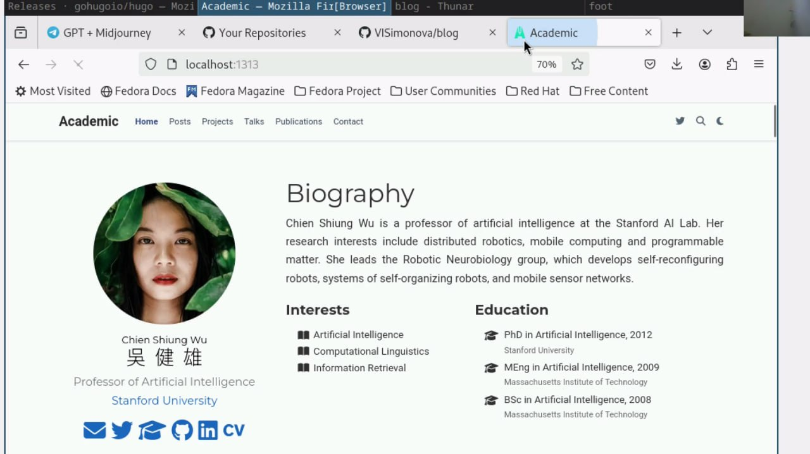{#fig:011 width=70%}

## Установка параметра URLs 

Созадю репозиторий, имя которого станет адресом для сайта (рис. [-@fig:012]).

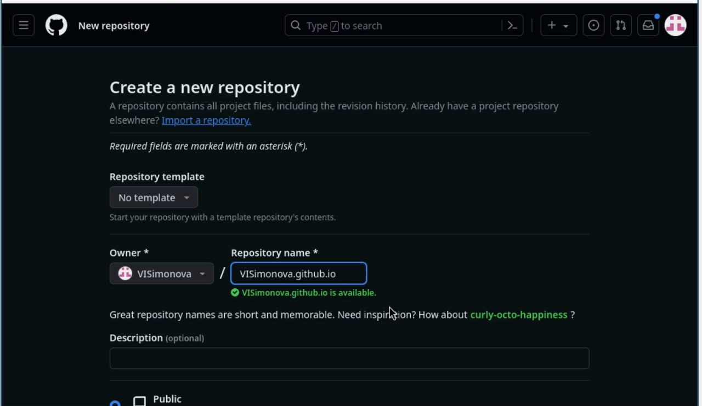{#fig:012 width=70%}

Репощиторий создался (рис. [-@fig:013]).

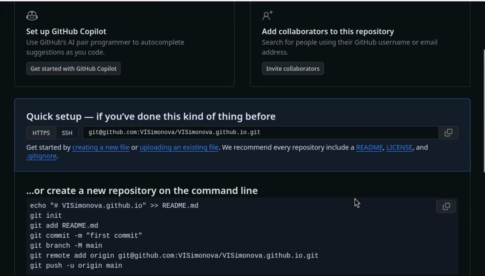{#fig:013 width=70%}

Клонирую его и создаю репозиторий у себя на компьютере и проверяю его наличие (рис. [-@fig:014]).

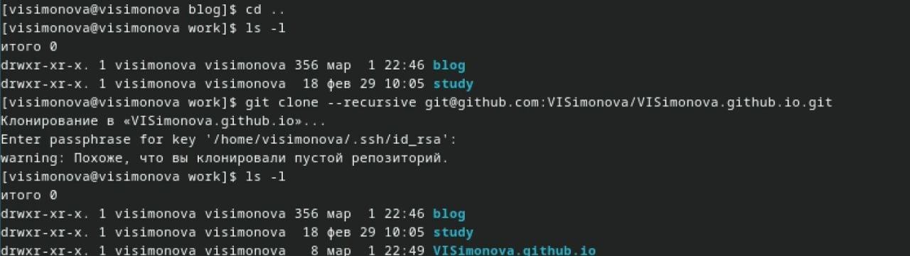{#fig:014 width=70%}

Создаю главную ветку с именем main и пустой файл README.md и отправляю всё этов глобальный репозиторий,  чтобы его активировать (рис. [-@fig:015]).

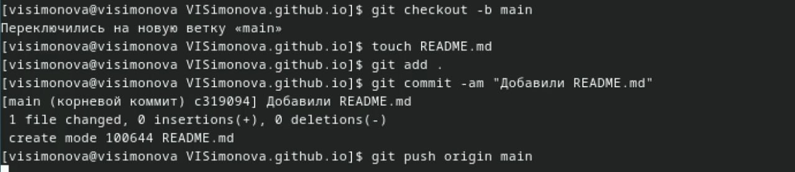{#fig:015 width=70%}

Активация репозитория (рис. [-@fig:016]).

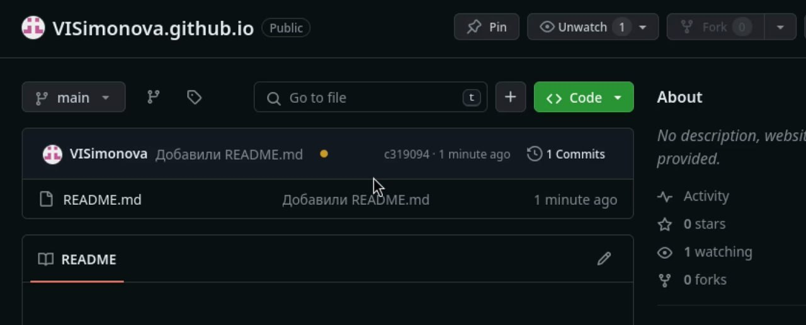{#fig:016 width=70%}

Пытаюсь подключить созданный п=репозиторий к папке public (рис. [-@fig:017]).

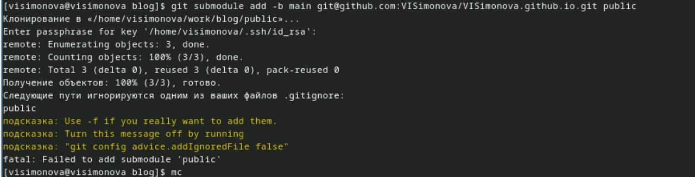{#fig:017 width=70%}

Отключаю игнорирование каталогов с названием public (рис. [-@fig:018]).

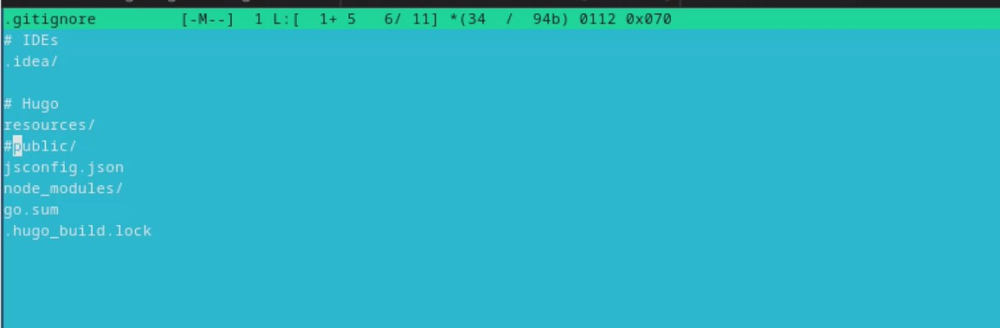{#fig:018 width=70%}

Проверяю, что файл изменился и подключаю репозиторий к каталогу public (рис. [-@fig:019]).

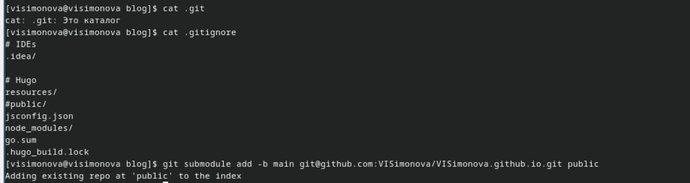{#fig:019 width=70%}

Снова запускаю исполняемый файл, чтобы заполнить зозданный каталог (рис. [-@fig:020]).

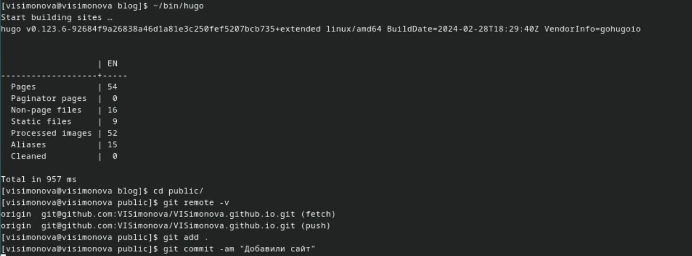{#fig:020 width=70%}

## Размещение заготовки сайта на github pages 

Добавляю изменения в репозиторий (рис. [-@fig:021]).

{#fig:021 width=70%}

Изменения добавились в репозиторий (рис. [-@fig:022]).

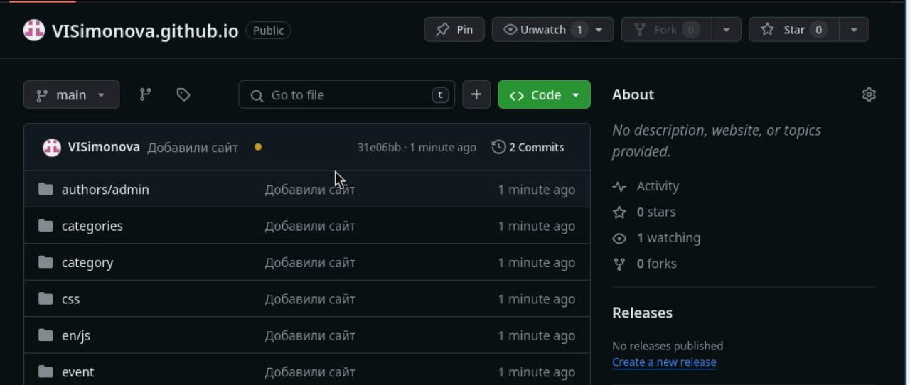{#fig:022 width=70%}

# Выводы

Научилась размещать сайт на github pages и выполнила первый этап реализации индивидуального проекта.

# Список литературы{.unnumbered}

1. Dash, P. Getting Started with Oracle VM VirtualBox / P. Dash. – Packt Publishing Ltd, 2013. – 86 сс.
2. Colvin, H. VirtualBox: An Ultimate Guide Book on Virtualization with VirtualBox. VirtualBox / H. Colvin. – CreateSpace Independent Publishing Platform, 2015. – 70 сс.
3. Vugt, S. van. Red Hat RHCSA/RHCE 7 cert guide : Red Hat Enterprise Linux 7 (EX200 and EX300) : Certification Guide. Red Hat RHCSA/RHCE 7 cert guide / S. van Vugt. – Pearson IT Certification, 2016. – 1008 сс.
4. Робачевский, А. Операционная система UNIX / А. Робачевский, С. Немнюгин, О. Стесик. – 2-е изд. – Санкт-Петербург : БХВ-Петербург, 2010. – 656 сс.
5. Немет, Э. Unix и Linux: руководство системного администратора. Unix и Linux / Э. Немет, Г. Снайдер, Т.Р. Хейн, Б. Уэйли. – 4-е изд. – Вильямс, 2014. – 1312 сс.
6. Колисниченко, Д.Н. Самоучитель системного администратора Linux : Системный администратор / Д.Н. Колисниченко. – Санкт-Петербург : БХВ-Петербург, 2011. – 544 сс.
7. Robbins, A. Bash Pocket Reference / A. Robbins. – O’Reilly Media, 2016. – 156 сс.
