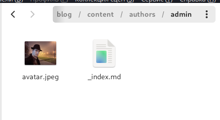
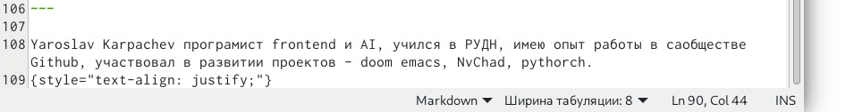
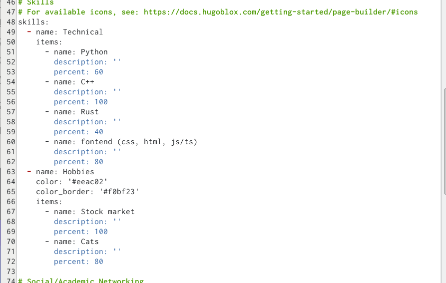
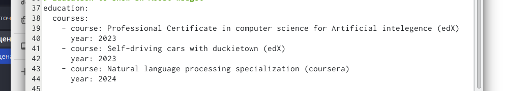
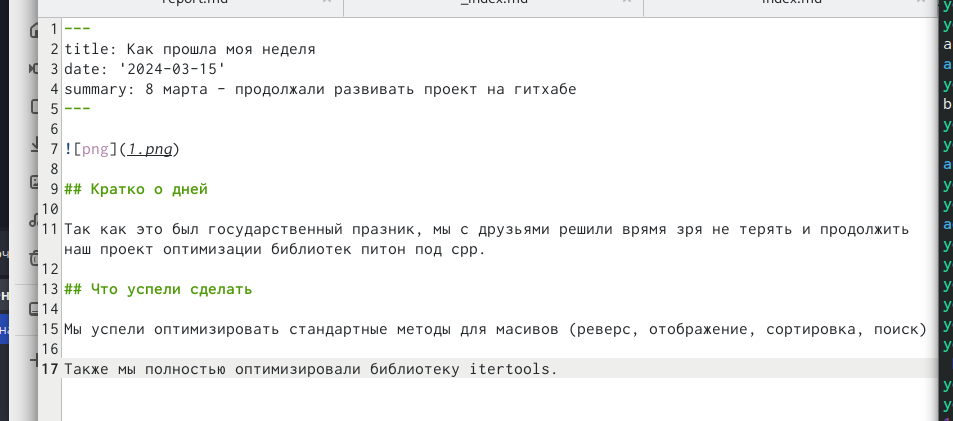
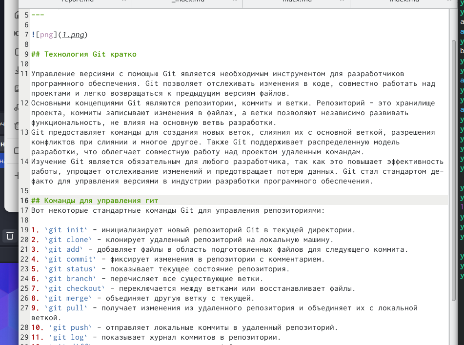
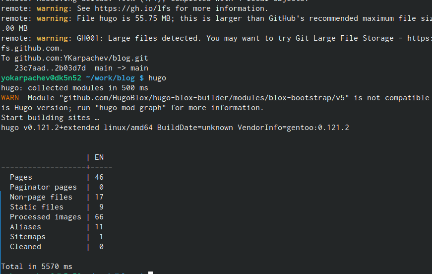
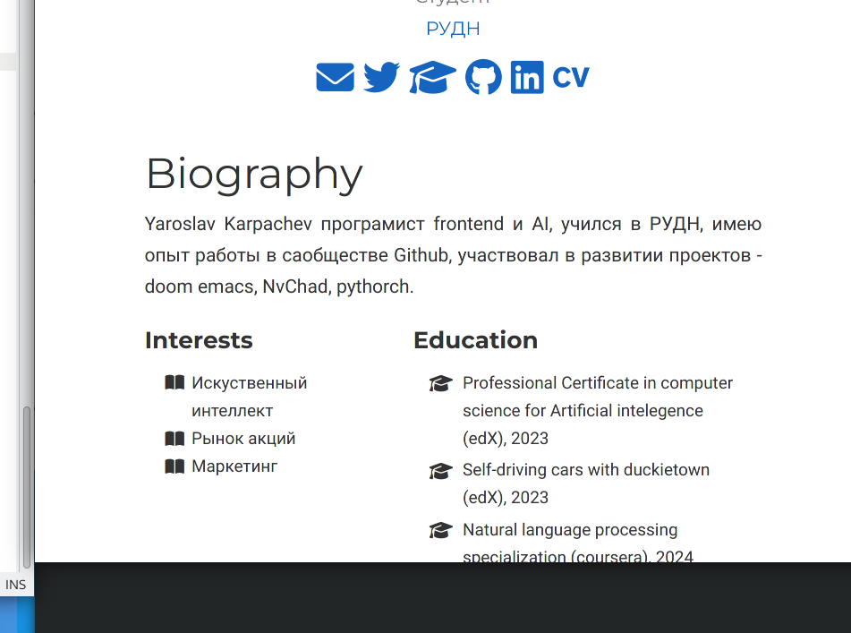
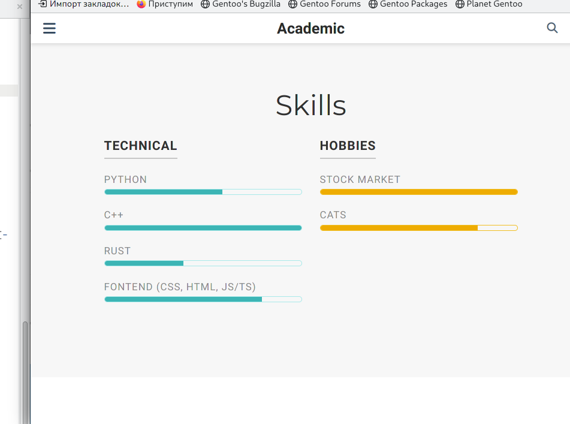
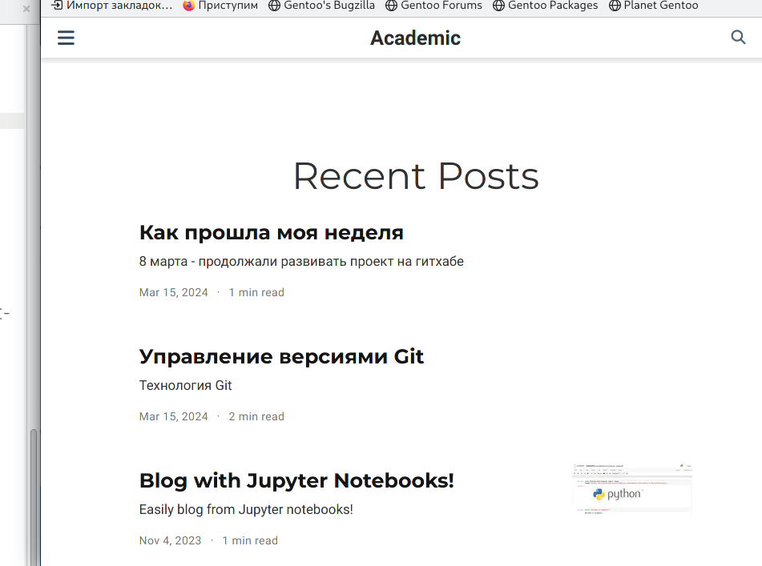

---
## Front matter
lang: ru-RU
title: Отчёт по 2 этапу индивидуального проекта
subtitle: Операционные системы
author:
  - Карпачев Ярослав
institute:
  - Российский университет дружбы народов, Москва, Россия
  - НБИбд-01-23
date: 14 марта 2024

## i18n babel
babel-lang: russian
babel-otherlangs: english

## Formatting pdf
toc: false
toc-title: Содержание
slide_level: 2
aspectratio: 169
section-titles: true
theme: metropolis
header-includes:
 - \metroset{progressbar=frametitle,sectionpage=progressbar,numbering=fraction}
 - '\makeatletter'
 - '\beamer@ignorenonframefalse'
 - '\makeatother'

## Fonts
mainfont: PT Serif
romanfont: PT Serif
sansfont: PT Sans
monofont: PT Mono
mainfontoptions: Ligatures=TeX
romanfontoptions: Ligatures=TeX
sansfontoptions: Ligatures=TeX,Scale=MatchLowercase
monofontoptions: Scale=MatchLowercase,Scale=0.9
---

## Докладчик

:::::::::::::: {.columns align=center}
::: {.column width="70%"}

  * Карпачев Ярослав Олегович
  * Студент 
  * НКАбд-01-23
  * Российский университет дружбы народов
  * [1132232862@pfur.ru](mailto:113222862@rudn.ru)

:::
::: {.column width="30%"}

:::
::::::::::::::
# Цель работы

Продолжить работы со своим сайтом. Редактировать его в соответствии с требованиями. Добавить данные о себе.

# Задание

Добавить на сайт информацию 
Список добавляемых данных.
* Разместить фотографию владельца сайта.
* Разместить краткое описание владельца сайта (Biography).
* Добавить информацию об интересах (Interests).
** Добавить информацию от образовании (Education).
** Сделать пост по прошедшей неделе.
** Добавить пост на тему по выбору:
** Управление версиями. Git.
** Непрерывная интеграция и непрерывное развертывание (CI/CD).

# Выполнение лабораторной работы

## Добавляем биографию + фото

##
Добавил фото перетащив его в нужную папку

##
добавил биографию 
{#fig:002 width=70%}

##
добавил свои навыки
{#fig:003 width=70%}

##
добавил курсы
{#fig:004 width=70%}

## делаем посты

##
делаем пост про прощедшую неделю

##
делаем пост про Git

## Загрузка + проверка

##
Запуск hugo 

##
загрузка на гитхаб + проверка.

# Выводы

Этап 2 пройден (добавленая биография и фото)

# Список литературы{.unnumbered}

::: {#refs}
:::
