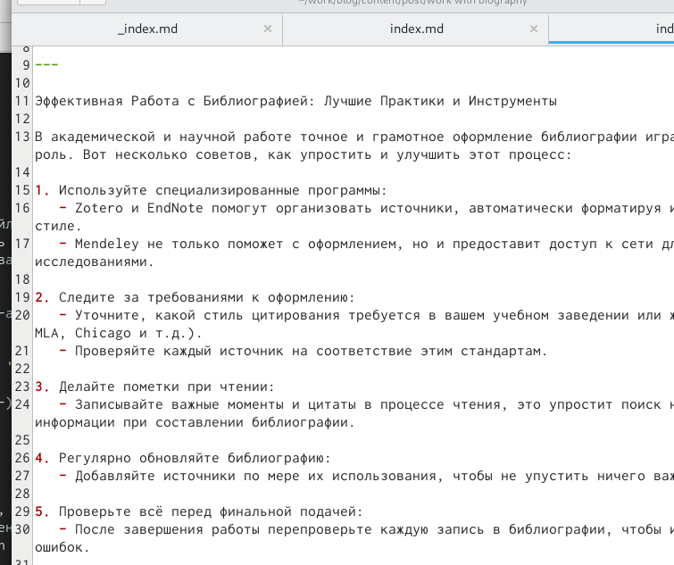

---
## Front matter
lang: ru-RU
title: Отчёт по 2 этапу индивидуального проекта
subtitle: Операционные системы
author:
  - Карпачев Ярослав
institute:
  - Российский университет дружбы народов, Москва, Россия
  - НБИбд-01-23
date: 14 марта 2024

## i18n babel
babel-lang: russian
babel-otherlangs: english

## Formatting pdf
toc: false
toc-title: Содержание
slide_level: 2
aspectratio: 169
section-titles: true
theme: metropolis
header-includes:
 - \metroset{progressbar=frametitle,sectionpage=progressbar,numbering=fraction}
 - '\makeatletter'
 - '\beamer@ignorenonframefalse'
 - '\makeatother'

## Fonts
mainfont: PT Serif
romanfont: PT Serif
sansfont: PT Sans
monofont: PT Mono
mainfontoptions: Ligatures=TeX
romanfontoptions: Ligatures=TeX
sansfontoptions: Ligatures=TeX,Scale=MatchLowercase
monofontoptions: Scale=MatchLowercase,Scale=0.9
---

## Докладчик

:::::::::::::: {.columns align=center}
::: {.column width="70%"}

  * Карпачев Ярослав Олегович
  * Студент 
  * НКАбд-01-23
  * Российский университет дружбы народов
  * [1132232862@pfur.ru](mailto:113222862@rudn.ru)

:::
::: {.column width="30%"}

:::
::::::::::::::
# Цель работы

Продолжить работы со своим сайтом. Редактировать его в соответствии с требованиями. Добавить данные о себе.

# Задание

Добавить к сайту ссылки на научные и библиометрические ресурсы.

- Зарегистрироваться на соответствующих ресурсах и разместить на них ссылки на сайте:
1. eLibrary : https://elibrary.ru/;
2. Google Scholar : https://scholar.google.com/;
3. ORCID : https://orcid.org/;
4. Mendeley : https://www.mendeley.com/;
5. ResearchGate : https://www.researchgate.net/;
6. Academia.edu : https://www.academia.edu/;
7. arXiv : https://arxiv.org/;
8. github : https://github.com/.
- Сделать пост по прошедшей неделе.
- Добавить пост на тему по выбору:
1. Оформление отчёта.
2. Создание презентаций.
3. Работа с библиографией.

# Выполнение лабораторной работы

## Зарегистрироваться на сайтах и добавить их на сайт (рис. [-@fig:001]).

{#fig:001 width=70%}

## Добавляем посты

## делаем пост про прощедшую неделю 3 (рис. [-@fig:004]), делаем пост про работу с биографией (рис. [-@fig:005]).

{#fig:004 width=70%}

{#fig:005 width=70%}

## Загрузка + проверка

## Запуск hugo, загрузка на гитхаб + проверка сайта (рис. [-@fig:006]) (рис. [-@fig:007])

{#fig:006 width=70%}

{#fig:006 width=70%}
